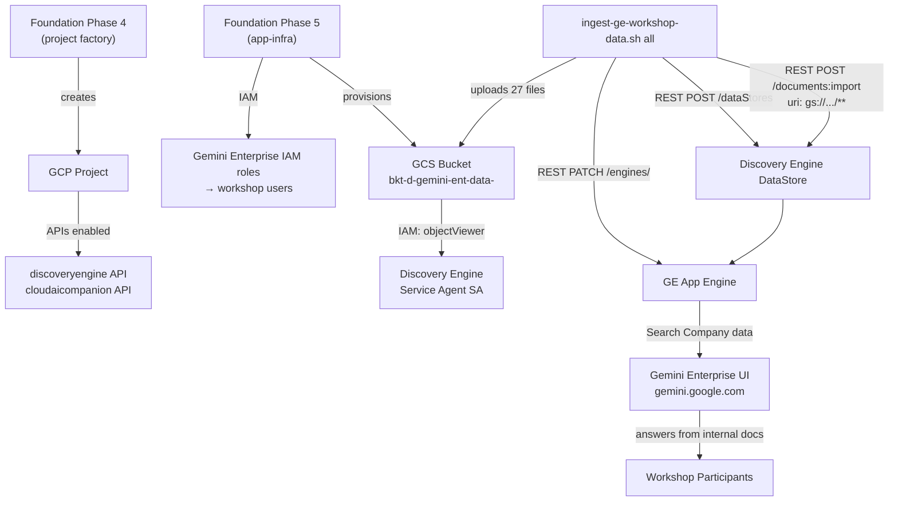

# Gemini Enterprise Workshop Setup Guide

> **Audience**: Platform engineers deploying Gemini Enterprise for the first time and setting up the [GE Value Workshop](https://github.com/caugusto/GE-Value-workshop).
> **Time estimate**: ~45 minutes infrastructure setup + ~15 minutes validation.
> **Last updated**: 2026-10-01

---

## Table of Contents

1. [Overview](#1-overview)
2. [Architecture](#2-architecture)
3. [Prerequisites](#3-prerequisites)
4. [Phase 1A — Foundation Terraform](#4-phase-1a--foundation-terraform) *(skip if using Path B)*
   - [1.0 Assign Gemini Enterprise Workspace Licences](#10-assign-gemini-enterprise-workspace-licences)
   - [1.1 GCP Project (Phase 4)](#11-gcp-project-phase-4)
   - [1.2 API Enablement](#12-api-enablement)
   - [1.3 IAM Bindings (Phase 5)](#13-iam-bindings-phase-5)
   - [1.4 Workshop GCS Bucket (Phase 5)](#14-workshop-gcs-bucket-phase-5)
   - [1.5 Apply via Cloud Build](#15-apply-via-cloud-build)
5. [Phase 1B — Manual Setup (gcloud CLI)](#5-phase-1b--manual-setup-gcloud-cli) *(skip if using Path A)*
   - [B.0 Assign Workspace Licences](#b0-assign-workspace-licences)
   - [B.1 Enable APIs](#b1-enable-apis)
   - [B.2 Grant IAM Roles](#b2-grant-iam-roles)
   - [B.3 Create Workshop GCS Bucket](#b3-create-workshop-gcs-bucket)
6. [Phase 2 — Workshop Data Ingestion](#6-phase-2--workshop-data-ingestion)
   - [2.1 Run the Ingestion Script](#21-run-the-ingestion-script)
   - [2.2 What the Script Does](#22-what-the-script-does)
   - [2.3 Verify Indexing](#23-verify-indexing)
7. [Gotchas & Known Issues](#7-gotchas--known-issues)
8. [Validation Checklist](#8-validation-checklist)
9. [Workshop Exercises Reference](#9-workshop-exercises-reference)
10. [Resource Reference](#10-resource-reference)

---

## 1. Overview

**Gemini Enterprise** is Google's enterprise AI assistant with secure access to internal company data via Discovery Engine datastores. This guide covers:

- Provisioning the GCP project, enabling required APIs, and granting IAM roles via the Terraform foundation.
- Creating a GCS bucket and loading the workshop sample dataset.
- Creating a Discovery Engine datastore, ingesting documents, and attaching it to the Gemini Enterprise app engine so users can search internal data.
- Validating end-to-end with the sample prompts from the [GE Jumpstart guide](https://github.com/caugusto/GE-Value-workshop/blob/main/ge_jumpstart.md).

---

## 2. Architecture



---

## 3. Prerequisites

Before starting, ensure the following are in place:

| Requirement | Details |
|---|---|
| Foundation phases 0–3 deployed | Bootstrap, org, environments, and networks must already exist |
| `gcloud` CLI authenticated | `gcloud auth login` and `gcloud auth application-default login` |
| Terraform ≥ 1.5.0 | Only needed for local `init` / `validate`; applies run via Cloud Build |
| Gemini Enterprise licences | Must be assigned to each participant — see [Step 1.0](#10-assign-gemini-enterprise-workspace-licences) |
| CI/CD Cloud Build seed project | Applies run in `<SEED_PROJECT>` via manual trigger (no local applies) |

> [!IMPORTANT]
> Complete [Step 1.0 — Workspace Licence Assignment](#10-assign-gemini-enterprise-workspace-licences) **before** running any workshop exercises. Participants can authenticate to GCP without a licence but will see no Gemini Enterprise features in the UI.

---

## 4. Phase 1A — Foundation Terraform

> [!NOTE]
> **Choose your setup path:**
> - **Path A (this section)** — You have a Terraform foundation (phases 0–3) already deployed. Infrastructure is codified and applied via Cloud Build. Recommended for production-grade and repeatable environments.
> - **[Path B (next section)](#5-phase-1b--manual-setup-gcloud-cli)** — You have an existing GCP project with billing linked, but no Terraform foundation. Everything is provisioned directly via `gcloud` CLI in minutes. Recommended for quick workshop prep, demos, and sandboxes.
>
> **Both paths converge at [Phase 2 — Data Ingestion](#6-phase-2--workshop-data-ingestion).**

All infrastructure is codified in the Terraform foundation. Changes are made in two phases:

| Phase | Directory | What it controls |
|---|---|---|
| Phase 4 | `foundation/4-projects/envs/development/` | GCP project creation, API enablement |
| Phase 5 | `foundation/5-app-infra/envs/development/` | IAM bindings, GCS bucket |

### 1.0 Assign Gemini Enterprise Workspace Licences

> [!CAUTION]
> This step must be completed **before** participants attempt to access the GE UI. Without a licence, users see a standard Google account page — not Gemini Enterprise — even if all IAM and GCP config is correct.

Licences are assigned per-user in the Google Workspace Admin console by a **Workspace Super Admin**.

**Steps:**

1. Sign in to the [Google Workspace Admin console](https://admin.google.com) as a Super Admin.
2. Navigate to **Users** → find and click the participant's account.
3. Click **Licences** in the left panel.
4. Scroll to **Gemini Enterprise** and click **Edit**.
5. Toggle the licence **On** → click **Save**.
6. Repeat for each participant.

> [!NOTE]
> Licence assignment can also be done in bulk via the Admin SDK or by assigning licences to an **Organizational Unit (OU)** or **Group**:
> - **OU-based**: Navigate to **Billing → Subscriptions → Gemini Enterprise → Assign licences** and select the OU containing your participants.
> - **Group-based**: Use the [Google Workspace Admin SDK `licenseManager`](https://developers.google.com/admin-sdk/licensing) for scripted bulk assignment.

**Verify a licence is active:**

After assignment, ask the participant to visit [gemini.google.com](https://gemini.google.com) and sign in with their org account. They should see the full Gemini Enterprise interface (Omnibar with Tools, model selector, etc.) rather than a generic landing page.

---

### 1.1 GCP Project (Phase 4)

Add a new project module to `foundation/4-projects/envs/development/main.tf`:

```hcl
module "prj_d_gemini_ent_01" {
  source = "../../modules/project"

  project_name               = "prj-d-gemini-ent-01"
  project_id                 = "<PROJECT_ID>"
  folder_id                  = local.folder_id
  billing_account            = var.billing_account
  shared_vpc_host_project_id = "" # Isolated network — no shared VPC needed
  security_contact           = "<SECURITY_GROUP>@<ORG_DOMAIN>"
  technical_contact          = "<DEVOPS_GROUP>@<ORG_DOMAIN>"
  deletion_policy            = "DELETE"

  labels = {
    environment = "dev"
    application = "backend-services"
    cost_center = "<COST_CENTER>"
    team        = "<TEAM>"
  }

  apis_to_enable = [
    "compute.googleapis.com",
    "cloudaicompanion.googleapis.com",   # Required for Gemini Enterprise
    "cloudbuild.googleapis.com",
    "storage.googleapis.com",
    "logging.googleapis.com",
    "monitoring.googleapis.com",
    "discoveryengine.googleapis.com",    # Required for Discovery Engine / Search
  ]
}
```

Add the project ID output so Phase 5 can consume it:

```hcl
# foundation/4-projects/envs/development/outputs.tf
output "prj_d_gemini_ent_01_project_id" {
  value       = module.prj_d_gemini_ent_01.project_id
  description = "Project ID of the Gemini Enterprise project."
}
```

### 1.2 API Enablement

The two critical APIs for Gemini Enterprise are:

| API | Purpose |
|---|---|
| `discoveryengine.googleapis.com` | Powers Discovery Engine datastores and the "Search Company data" feature in GE |
| `cloudaicompanion.googleapis.com` | Required for the Gemini Enterprise app itself |

Both are declared in `apis_to_enable` above — no separate `google_project_service` resources needed when using the project factory module.

### 1.3 IAM Bindings (Phase 5)

In `foundation/5-app-infra/envs/development/gemini_enterprise.tf`, grant IAM roles based on each identity's function. Use **least privilege** — most participants only need `roles/discoveryengine.agentspaceUser`.

| Role | Who | What it allows |
|---|---|---|
| `roles/discoveryengine.agentspaceAdmin` | Facilitator / platform engineer | Full control: create datastores, attach engines, manage the GE app |
| `roles/discoveryengine.agentspaceUser` | **Workshop participants** | Access all GE apps in the project: chat, search company data, use all tools |
| `roles/discoveryengine.agentspaceRestrictedUser` | Participants scoped to a specific app | Denies access to all apps by default; pair with app-level `roles/discoveryengine.agentspaceUser` grant |
| `roles/discoveryengine.notebookLmUser` | Participants using NotebookLM exercises | Access to NotebookLM within GE |

> [!IMPORTANT]
> IAM grants alone are not sufficient. Each participant must also have a **Gemini Enterprise Workspace licence** assigned by a Google Workspace Admin before they can access the GE UI. Licence assignment is done in the [Google Workspace Admin console](https://admin.google.com) under **Users → Licences**.

```hcl
# ── Facilitator (admin access to manage datastores and the GE app) ──────────
resource "google_project_iam_member" "gemini_ent_admin_facilitator" {
  project = local.project_id_gemini_ent
  role    = "roles/discoveryengine.agentspaceAdmin"
  member  = "user:<FACILITATOR>@<ORG_DOMAIN>"
}

# ── Workshop participants (user access — one block per participant) ──────────
resource "google_project_iam_member" "gemini_ent_user_participant_1" {
  project = local.project_id_gemini_ent
  role    = "roles/discoveryengine.agentspaceUser"
  member  = "user:<PARTICIPANT_1>@<ORG_DOMAIN>"
}

resource "google_project_iam_member" "gemini_ent_user_participant_2" {
  project = local.project_id_gemini_ent
  role    = "roles/discoveryengine.agentspaceUser"
  member  = "user:<PARTICIPANT_2>@<ORG_DOMAIN>"
}

# ── Optional: NotebookLM access for exercises that use it ───────────────────
resource "google_project_iam_member" "gemini_ent_notebooklm_participant_1" {
  project = local.project_id_gemini_ent
  role    = "roles/discoveryengine.notebookLmUser"
  member  = "user:<PARTICIPANT_1>@<ORG_DOMAIN>"
}
```

> [!NOTE]
> The `local.project_id_gemini_ent` local is defined in `foundation/5-app-infra/envs/development/remote.tf` via a `terraform_remote_state` lookup against the Phase 4 GCS state bucket:
> ```hcl
> locals {
>   project_id_gemini_ent = data.terraform_remote_state.projects.outputs.prj_d_gemini_ent_01_project_id
> }
> ```

### 1.4 Workshop GCS Bucket (Phase 5)

Still in `gemini_enterprise.tf`, add the workshop data bucket. The Discovery Engine service agent needs `objectViewer` on the bucket so it can read documents during indexing.

```hcl
# Resolve the numeric project number — needed for the Discovery Engine service agent SA.
data "google_project" "gemini_ent_project" {
  project_id = local.project_id_gemini_ent
}

module "gcs_bucket_gemini_ent_data" {
  source                      = "../../../../infra/modules/gcs-bucket"
  project_id                  = local.project_id_gemini_ent
  name                        = "bkt-d-gemini-ent-data-${local.project_id_gemini_ent}"
  location                    = local.default_region   # e.g. "us-central1"
  uniform_bucket_level_access = true

  labels = {
    environment         = "dev"
    application         = "backend-services"
    cost_center         = "<COST_CENTER>"
    team                = "<TEAM>"
    data_classification = "internal-only"
  }

  iam_members = [
    # Discovery Engine service agent — must have objectViewer to read docs during ingestion
    {
      role   = "roles/storage.objectViewer"
      member = "serviceAccount:service-${data.google_project.gemini_ent_project.number}@gcp-sa-discoveryengine.iam.gserviceaccount.com"
    },
    # Workshop users — objectUser so they can upload custom data files
    {
      role   = "roles/storage.objectUser"
      member = "user:<USER_1>@<ORG_DOMAIN>"
    },
    {
      role   = "roles/storage.objectUser"
      member = "user:<USER_2>@<ORG_DOMAIN>"
    },
  ]
}
```

> [!IMPORTANT]
> The Discovery Engine service agent SA follows the pattern `service-<PROJECT_NUMBER>@gcp-sa-discoveryengine.iam.gserviceaccount.com`. It is **automatically created** when the `discoveryengine.googleapis.com` API is first enabled — it does not need to be manually created. Use the `data.google_project` data source to resolve the project number dynamically rather than hardcoding it.

### 1.5 Apply via Cloud Build

This project follows a **no local apply** mandate. All Terraform applies run through Cloud Build in the seed project.

```bash
# Phase 4 — create the GCP project and enable APIs
gcloud builds triggers run phase-4-projects-development-apply \
  --project=<SEED_PROJECT> \
  --region=us-central1 \
  --branch=main

# Phase 5 — apply IAM bindings and GCS bucket
gcloud builds triggers run phase-5-app-infra-development-apply \
  --project=<SEED_PROJECT> \
  --region=us-central1 \
  --branch=main
```

> [!NOTE]
> **Billing link**: In Argolis/restricted-billing orgs, the project may be created without a billing account linked. After Phase 4 applies, manually link the billing account in the GCP Console and re-run the Phase 5 apply.

After Phase 5 applies, verify the bucket and IAM exist:

```bash
# Confirm bucket exists
gcloud storage buckets describe gs://bkt-d-gemini-ent-data-<PROJECT_ID> \
  --project=<PROJECT_ID>

# Confirm IAM on bucket
gcloud storage buckets get-iam-policy gs://bkt-d-gemini-ent-data-<PROJECT_ID>
```

---

## 5. Phase 1B — Manual Setup (gcloud CLI)

> [!NOTE]
> **Use this path** if you have an existing GCP project with billing linked but no Terraform foundation. All steps run directly against the GCP project using `gcloud`. Skip to [Phase 2](#6-phase-2--workshop-data-ingestion) once complete.
>
> **Prerequisites for this path:** A GCP project with billing linked, and `gcloud` authenticated as a user with `roles/owner` or `roles/editor` + `roles/iam.securityAdmin` on the project.

### B.0 Assign Workspace Licences

Same as [Step 1.0](#10-assign-gemini-enterprise-workspace-licences) in Path A — assign a **Gemini Enterprise Workspace licence** to each participant in the [Google Workspace Admin console](https://admin.google.com) before they attempt to access the GE UI.

---

### B.1 Enable APIs

```bash
gcloud services enable \
  discoveryengine.googleapis.com \
  cloudaicompanion.googleapis.com \
  storage.googleapis.com \
  logging.googleapis.com \
  monitoring.googleapis.com \
  --project=<PROJECT_ID>
```

Enabling `discoveryengine.googleapis.com` automatically creates the Discovery Engine service agent SA (`service-<PROJECT_NUMBER>@gcp-sa-discoveryengine.iam.gserviceaccount.com`). This SA is needed in the next step.

---

### B.2 Grant IAM Roles

```bash
# ── Facilitator: full admin access to manage datastores and the GE app ──────
gcloud projects add-iam-policy-binding <PROJECT_ID> \
  --member="user:<FACILITATOR>@<ORG_DOMAIN>" \
  --role="roles/discoveryengine.agentspaceAdmin"

# ── Participants: user access to all GE apps in the project ─────────────────
# Repeat for each participant
gcloud projects add-iam-policy-binding <PROJECT_ID> \
  --member="user:<PARTICIPANT_1>@<ORG_DOMAIN>" \
  --role="roles/discoveryengine.agentspaceUser"

gcloud projects add-iam-policy-binding <PROJECT_ID> \
  --member="user:<PARTICIPANT_2>@<ORG_DOMAIN>" \
  --role="roles/discoveryengine.agentspaceUser"

# ── Optional: NotebookLM access ──────────────────────────────────────────────
gcloud projects add-iam-policy-binding <PROJECT_ID> \
  --member="user:<PARTICIPANT_1>@<ORG_DOMAIN>" \
  --role="roles/discoveryengine.notebookLmUser"
```

---

### B.3 Create Workshop GCS Bucket

```bash
# Resolve project number (needed for the Discovery Engine service agent SA)
PROJECT_NUMBER=$(gcloud projects describe <PROJECT_ID> \
  --format='value(projectNumber)')

# Create the bucket
gcloud storage buckets create gs://bkt-d-gemini-ent-data-<PROJECT_ID> \
  --project=<PROJECT_ID> \
  --location=us-central1 \
  --uniform-bucket-level-access \
  --public-access-prevention

# Grant Discovery Engine service agent read access (required for document indexing)
gcloud storage buckets add-iam-policy-binding \
  gs://bkt-d-gemini-ent-data-<PROJECT_ID> \
  --member="serviceAccount:service-${PROJECT_NUMBER}@gcp-sa-discoveryengine.iam.gserviceaccount.com" \
  --role="roles/storage.objectViewer"

# Grant users write access to the bucket
gcloud storage buckets add-iam-policy-binding \
  gs://bkt-d-gemini-ent-data-<PROJECT_ID> \
  --member="user:<FACILITATOR>@<ORG_DOMAIN>" \
  --role="roles/storage.objectUser"

gcloud storage buckets add-iam-policy-binding \
  gs://bkt-d-gemini-ent-data-<PROJECT_ID> \
  --member="user:<PARTICIPANT_1>@<ORG_DOMAIN>" \
  --role="roles/storage.objectUser"
```

**Verify:**

```bash
gcloud storage buckets describe gs://bkt-d-gemini-ent-data-<PROJECT_ID>
gcloud storage buckets get-iam-policy gs://bkt-d-gemini-ent-data-<PROJECT_ID>
```

> [!NOTE]
> The bucket name `bkt-d-gemini-ent-data-<PROJECT_ID>` is the default expected by the ingestion script. If you use a different name, pass it with `--bucket <BUCKET_NAME>` when running the script in Phase 2.

---

## 6. Phase 2 — Workshop Data Ingestion

Once the bucket exists, use the helper script to load data and wire up Discovery Engine end-to-end.

### 2.1 Run the Ingestion Script

```bash
./scripts/ingest-ge-workshop-data.sh all --project <PROJECT_ID>
```

The `all` command runs four steps in sequence. Expect it to complete in under 2 minutes (excluding background indexing time).

### 2.2 What the Script Does

#### Step 1 — Upload sample data to GCS

Downloads [`ge_sample_data_for_workshop.zip`](https://github.com/caugusto/GE-Value-workshop/blob/main/data/ge_sample_data_for_workshop.zip) from the upstream workshop repo, unpacks it, and uploads all 27 files to the bucket:

```
gs://bkt-d-gemini-ent-data-<PROJECT_ID>/ge_sample_data_for_workshop/
  ├── US State Population Percentages CSV.txt
  ├── microservices.pdf
  ├── pie_chart_customer_sentiment-png.png
  ├── robot_icon.jpg
  ├── sales_performance.txt
  ├── acme-co/
  │   ├── Web Company's Product Capabilities.pdf
  │   └── Web Design RFP.pdf
  ├── cymbal-bank-employee/
  │   ├── Cymbal Bank - Strategic Plan for Fiscal Year 2024-2025.pdf
  │   ├── Cymbal Bank Business Travel Guide.pdf
  │   ├── Cymbal Bank Company Culture.pdf
  │   ├── Cymbal Bank Founding Story.pdf
  │   ├── Cymbal Bank New Employee Guide.pdf
  │   ├── Cymbal Bank Organizations & Roles.pdf
  │   └── Project Plan_ Implementation of New Digital Banking Platform for Cymbal Bank.pdf
  └── xyz-sales-company/
      ├── notebooklm/  (MARKETING_data.txt, SALES_data.txt, customer_feedback.txt)
      └── sales/       (CRM_data.txt, ERP_data.txt, PRODUCT_data.txt, and more)
```

#### Step 2 — Create Discovery Engine DataStore

Calls the Discovery Engine REST API to create a Cloud Storage-backed datastore:

```bash
POST https://discoveryengine.googleapis.com/v1/projects/<PROJECT_ID>/locations/global/collections/default_collection/dataStores?dataStoreId=<DATASTORE_ID>

{
  "displayName": "Cloud Storage",
  "industryVertical": "GENERIC",
  "solutionTypes": ["SOLUTION_TYPE_SEARCH"],
  "contentConfig": "CONTENT_REQUIRED"
}
```

This call is idempotent — if the datastore already exists (HTTP 409), the script continues without error.

#### Step 3 — Import Documents from GCS

Triggers document ingestion with a **recursive glob** (`/**`) to include all subdirectories:

```bash
POST https://discoveryengine.googleapis.com/v1/projects/<PROJECT_ID>/locations/global/collections/default_collection/dataStores/<DATASTORE_ID>/branches/0/documents:import

{
  "gcsSource": {
    "inputUris": ["gs://bkt-d-gemini-ent-data-<PROJECT_ID>/ge_sample_data_for_workshop/**"],
    "dataSchema": "content"
  },
  "reconciliationMode": "FULL"
}
```

This returns a long-running operation. Indexing runs asynchronously in the background — **documents are not immediately searchable**. See [Section 2.3](#23-verify-indexing) for how to confirm completion.

> [!CAUTION]
> Use `/**` (double star) not `/*` (single star). A single `/*` only matches files at the top level of the prefix and silently ignores subdirectories. All Cymbal Bank and ACME documents live in subdirectories and will not be indexed with `/*`.

#### Step 4 — Attach DataStore to GE App Engine

Attaches the datastore to the Gemini Enterprise app engine so it appears in the "Search Company data" tool:

```bash
PATCH https://discoveryengine.googleapis.com/v1/projects/<PROJECT_ID>/locations/global/collections/default_collection/engines/<GE_ENGINE_ID>?updateMask=dataStoreIds

{
  "dataStoreIds": ["<DATASTORE_ID>"]
}
```

> [!NOTE]
> The `<GE_ENGINE_ID>` is the engine ID of your Gemini Enterprise app. Find it in the [GE Admin Console](https://console.cloud.google.com/gemini-enterprise) under **Engines**, or via:
> ```bash
> curl -s -H "Authorization: Bearer $(gcloud auth print-access-token)" \
>   -H "x-goog-user-project: <PROJECT_ID>" \
>   "https://discoveryengine.googleapis.com/v1/projects/<PROJECT_ID>/locations/global/collections/default_collection/engines"
> ```

Pass a custom engine ID with `--engine-id` if yours differs from the default:

```bash
./scripts/ingest-ge-workshop-data.sh attach-engine \
  --datastore-id <DATASTORE_ID> \
  --engine-id <GE_ENGINE_ID> \
  --project <PROJECT_ID>
```

### 2.3 Verify Indexing

The import is asynchronous. Poll the operation until `"done": true` and `successCount` equals `totalCount`:

```bash
TOKEN=$(gcloud auth print-access-token)

curl -s \
  -H "Authorization: Bearer $TOKEN" \
  -H "x-goog-user-project: <PROJECT_ID>" \
  "https://discoveryengine.googleapis.com/v1/projects/<PROJECT_NUMBER>/locations/global/collections/default_collection/dataStores/<DATASTORE_ID>/branches/0/operations/<OPERATION_ID>"
```

A completed import looks like:

```json
{
  "name": "...",
  "metadata": {
    "@type": "type.googleapis.com/google.cloud.discoveryengine.v1.ImportDocumentsMetadata",
    "createTime": "...",
    "updateTime": "...",
    "successCount": "27",
    "totalCount": "27"
  },
  "done": true
}
```

You can also do a quick API search to confirm documents are queryable:

```bash
curl -s -X POST \
  -H "Authorization: Bearer $(gcloud auth print-access-token)" \
  -H "x-goog-user-project: <PROJECT_ID>" \
  -H "Content-Type: application/json" \
  "https://discoveryengine.googleapis.com/v1/projects/<PROJECT_NUMBER>/locations/global/collections/default_collection/dataStores/<DATASTORE_ID>/servingConfigs/default_config:search" \
  -d '{"query": "sales", "pageSize": 3}'
```

Expect at least one result with `semanticState: "ENABLED"`. If `results` is empty, indexing is still in progress — wait 2–3 minutes and retry.

---

## 6. Gotchas & Known Issues

These are the issues discovered during initial setup that will save you time.

### `/*` vs `/**` — Recursive glob is required

**Problem**: The Discovery Engine import API treats `gs://bucket/prefix/*` as matching only top-level objects directly under the prefix. Subdirectory objects are silently skipped.

**Symptom**: `successCount` and `totalCount` both show 5 (only the top-level files), but 27 files are in the bucket. Queries for documents in subdirectories (e.g., Cymbal Bank PDFs) return no results.

**Fix**: Always use `/**` in `inputUris`:

```json
"inputUris": ["gs://<BUCKET>/ge_sample_data_for_workshop/**"]
```

### DataStore must be attached to the GE App Engine

**Problem**: Creating a Discovery Engine datastore does **not** automatically make it available in the Gemini Enterprise "Search Company data" tool. The datastore must be explicitly attached to the GE app engine.

**Symptom**: Documents are indexed and API search works, but within the GE UI the "Search Company data" button either fails or returns no results.

**Fix**: Run the `attach-engine` command (included in `all`), or do it manually in the [GE Admin Console](https://console.cloud.google.com/gemini-enterprise) under **Engines → Data Sources → Add Data Store**.

The REST API call that fixes this:

```bash
curl -X PATCH \
  -H "Authorization: Bearer $(gcloud auth print-access-token)" \
  -H "x-goog-user-project: <PROJECT_ID>" \
  -H "Content-Type: application/json" \
  "https://discoveryengine.googleapis.com/v1/projects/<PROJECT_ID>/locations/global/collections/default_collection/engines/<GE_ENGINE_ID>?updateMask=dataStoreIds" \
  -d '{"dataStoreIds": ["<DATASTORE_ID>"]}'
```

### `x-goog-user-project` header is required for REST API calls

**Problem**: The Discovery Engine API requires a quota project to be set when using user (ADC) credentials. Without it, you receive HTTP 403 with reason `SERVICE_DISABLED` even though the API is enabled.

**Fix**: Always include `-H "x-goog-user-project: <PROJECT_ID>"` in Discovery Engine REST API calls.

### Indexing is asynchronous and takes time

**Problem**: The import operation returns immediately with a long-running operation name, but documents are not yet queryable. The operation `updateTime` may appear frozen in the early stages.

**Fix**: Wait 5–15 minutes after triggering the import, then poll the operation for `"done": true` and confirm `successCount == totalCount` before testing search.

### Discovery Engine service agent SA must have bucket access before import

**Problem**: If the GCS IAM binding for the Discovery Engine service agent (`service-<PROJECT_NUMBER>@gcp-sa-discoveryengine.iam.gserviceaccount.com`) is missing, the import operation will appear to succeed but no documents will be indexed (or it will fail silently with errors in the error GCS prefix).

**Fix**: Ensure `roles/storage.objectViewer` is granted to the service agent on the bucket **before** running the import. The Terraform module in Section 1.4 handles this.

---

## 7. Validation Checklist

Run these checks in order after completing both phases.

### Infrastructure checks

```bash
# 1. Bucket exists and has correct IAM
gcloud storage buckets describe gs://bkt-d-gemini-ent-data-<PROJECT_ID>
gcloud storage buckets get-iam-policy gs://bkt-d-gemini-ent-data-<PROJECT_ID>

# 2. All 27 workshop files are in the bucket
gcloud storage ls -r gs://bkt-d-gemini-ent-data-<PROJECT_ID>/ge_sample_data_for_workshop/ \
  | grep -v "/$" | wc -l
# Expected: 27

# 3. DataStore exists
curl -s \
  -H "Authorization: Bearer $(gcloud auth print-access-token)" \
  -H "x-goog-user-project: <PROJECT_ID>" \
  "https://discoveryengine.googleapis.com/v1/projects/<PROJECT_NUMBER>/locations/global/collections/default_collection/dataStores/<DATASTORE_ID>" \
  | python3 -m json.tool

# 4. DataStore is attached to GE engine
curl -s \
  -H "Authorization: Bearer $(gcloud auth print-access-token)" \
  -H "x-goog-user-project: <PROJECT_ID>" \
  "https://discoveryengine.googleapis.com/v1/projects/<PROJECT_NUMBER>/locations/global/collections/default_collection/engines/<GE_ENGINE_ID>" \
  | python3 -c "import sys,json; d=json.load(sys.stdin); print('DataStores:', d.get('dataStoreIds'))"
# Expected: DataStores: ['<DATASTORE_ID>']
```

### Search API check

```bash
curl -s -X POST \
  -H "Authorization: Bearer $(gcloud auth print-access-token)" \
  -H "x-goog-user-project: <PROJECT_ID>" \
  -H "Content-Type: application/json" \
  "https://discoveryengine.googleapis.com/v1/projects/<PROJECT_NUMBER>/locations/global/collections/default_collection/dataStores/<DATASTORE_ID>/servingConfigs/default_config:search" \
  -d '{"query": "CEO Cymbal Bank", "pageSize": 3}'
# Expected: results array with at least one document; semanticState: "ENABLED"
```

### Gemini Enterprise UI check

Log in as a workshop participant and run these prompts using **Tools → Search Company data**:

| Prompt | Expected response source |
|---|---|
| `Who is the CEO of Cymbal Bank?` | `cymbal-bank-employee/Cymbal Bank Founding Story.pdf` |
| `Summarize the customer sentiment pie chart` | `pie_chart_customer_sentiment-png.png` |
| `What were the top performing sales states?` | `sales_performance.txt` |

---

## 8. Workshop Exercises Reference

Once the environment is validated, participants follow the [GE Jumpstart guide](https://github.com/caugusto/GE-Value-workshop/blob/main/ge_jumpstart.md). The exercises that depend on the provisioned data are:

| Task | Exercise | Data used |
|---|---|---|
| Task 4 | File Analysis — upload `microservices.pdf` and ask about it | `microservices.pdf` (top-level) |
| Task 4 | Chart generation — upload `sales_performance.txt` as `.csv`, create pie chart | `sales_performance.txt` |
| Task 5 | Search internal data — `Who is the CEO of Cymbal Bank?` | `cymbal-bank-employee/*.pdf` |
| Task 5 | Image analysis — `Summarize the customer sentiment pie chart` | `pie_chart_customer_sentiment-png.png` |
| Task 6 | Multimodal image generation — upload `acme-co/Web Design RFP.pdf`, create infographic | `acme-co/Web Design RFP.pdf` |

Tasks 1–3 (interface navigation, prompting framework, personalization) and Tasks 6–14 (image/video generation, Canvas, Skills, NotebookLM, Agent Designer) do not depend on the provisioned GCS data.

---

## 9. Resource Reference

| Resource | Placeholder | Notes |
|---|---|---|
| GCP Project ID | `<PROJECT_ID>` | The dedicated GE project |
| GCP Project Number | `<PROJECT_NUMBER>` | Needed for the Discovery Engine SA; resolve via `gcloud projects describe <PROJECT_ID> --format='value(projectNumber)'` |
| GCS Bucket | `bkt-d-gemini-ent-data-<PROJECT_ID>` | Created by Terraform Phase 5; `uniform_bucket_level_access = true`, PAP enforced |
| Discovery Engine DataStore | `<DATASTORE_ID>` | Created by `create-datastore` script command; default `workshop-gcs-docs` |
| GE App Engine ID | `<GE_ENGINE_ID>` | The engine ID of your Gemini Enterprise app; find in GE Admin Console |
| Discovery Engine SA | `service-<PROJECT_NUMBER>@gcp-sa-discoveryengine.iam.gserviceaccount.com` | Auto-created when API is enabled |
| Ingestion script | `scripts/ingest-ge-workshop-data.sh` | Covers upload, datastore creation, import, and engine attachment |
| Cloud Build seed project | `<SEED_PROJECT>` | Where Cloud Build triggers run for Foundation applies |
| Workshop source repo | [caugusto/GE-Value-workshop](https://github.com/caugusto/GE-Value-workshop) | Sample data and Jumpstart exercises |
| Foundation Phase 4 | `foundation/4-projects/envs/development/main.tf` | Project factory; add project module here |
| Foundation Phase 5 | `foundation/5-app-infra/envs/development/gemini_enterprise.tf` | IAM + bucket; add/modify here |
| GE Admin Console | `https://console.cloud.google.com/gemini-enterprise?project=<PROJECT_ID>` | Manage engines, datastores, and users |
| Discovery Engine Console | `https://console.cloud.google.com/ai/discovery?project=<PROJECT_ID>` | View datastore status and indexed documents |

