<div id='top'></div>
<div class="toc-container">
<h3>Table of Contents</h3>
<ul>
  <li><a href="#section-1">Welcome & Prerequisites</a></li>
  <li><a href="#section-2">1: Navigating the Interface & Basic Assistant Features</a></li>
  <li><a href="#section-prompting">2: The ABCDQs of Prompting</a></li>
  <li><a href="#section-4">3: Configuring Personalization and Appearance</a></li>
  <li><a href="#section-3">4: Web Search, File Analysis & Data Handling</a></li>
  <li><a href="#section-5">5: Searching Internal Company Data</a></li>
  <li><a href="#section-8">6: Generating Media (Images and Video)</a></li>
  <li><a href="#section-canvas">7: Using the Canvas Feature</a></li>
  <li><a href="#section-skills">8: Using and Creating Skills</a></li>
  <li><a href="#section-9">9: Conducting Deep Research</a></li>
  <li><a href="#section-10">10: Unlocking Insights with Gemini Notebook</a></li>
  <li><a href="#section-11">11: Build a Chat Agent from a Prompt with Agent Designer</a></li>
  <li><a href="#section-12">12: Build a Chat Agent with the Agent Designer Builder (Manually)</a></li>
  <li><a href="#section-13">13: Build a Workflow Agent</a></li>
  <li><a href="#section-14">14: Gemini Notebook Challenge Labs</a></li>
</ul>
</div>
<br><br>

<div style="font-size: 1.2em;">

# Hands-on Lab: Unlocking Day 1 Value in Gemini Enterprise

Last Modified: 3/25/2026


<div id='section-1'></div>

# Welcome & Prerequisites

Welcome to the Gemini Enterprise hands-on lab! 

Gemini Enterprise is Google's premier AI assistant designed specifically for businesses. It provides secure, enterprise-grade access to Google's most capable AI models, seamlessly integrated with your organization's data ecosystem. Built from the ground up to prioritize data privacy and security, it ensures your sensitive corporate information remains protected.

By leveraging Gemini Enterprise, organizations can drastically accelerate everyday workflows, synthesize complex information rapidly, and foster deeper creative problem-solving. From drafting emails and generating extensive research reports to brainstorming strategies dynamically, Gemini acts as an intelligent collaborator that elevates team productivity across all departments.

In this session, you will explore the core day-one capabilities of the platform. Before we begin, please ensure you are logged into your provided Google account and have navigated to the Gemini Enterprise landing page. Your environment has already been provisioned with the necessary access to complete these exercises.

<br><br>

<div class="nav-link"><a href="#top">↑ Back to Top</a></div>

---

<div id='section-2'></div>

# Task 1: Navigating the Interface & Basic Assistant Features

Let's start by getting familiar with the Gemini Enterprise interface and some of its foundational tools.

1. **Introduce the Chat Assistant:**
   * In your app, you can chat about search results and uploaded content with the assistant. The assistant can provide summaries and answer questions through natural language conversations, and you can export the assistant's answers in common formats to share with others.

   <br>
   
   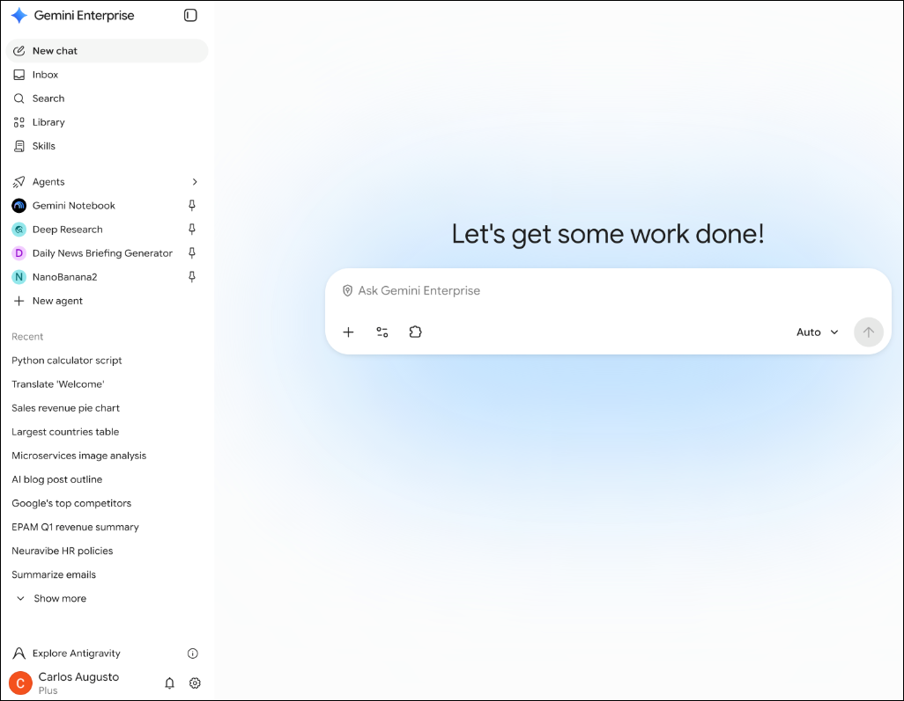


<br><br>

2. **Translation:** Gemini Enterprise can perform language translations. Click "New Chat" and, using the Omnibar, type a short phrase in English and ask Gemini Enterprise to translate it. For example: `Translate 'Welcome to the future of work' into Spanish, French, and Japanese.`

   <br>
   
   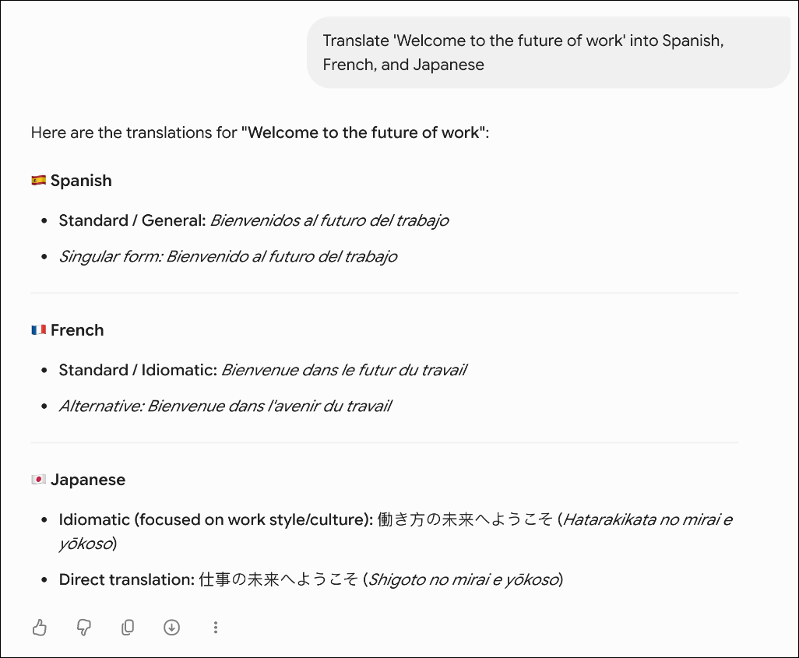

<br><br>

3. **Code Generation:**
   * Click **"New Chat"**.
   * Using the Omnibar, ask the assistant to generate a simple script. <br>
   * Type: `write a python script to create a basic calculator.` <br>
   * Notice that when the response generates, you can easily:
     * Click **Show code** to view the formatting.
     * Click the  icon to export it to your clipboard.

   <br>
   
   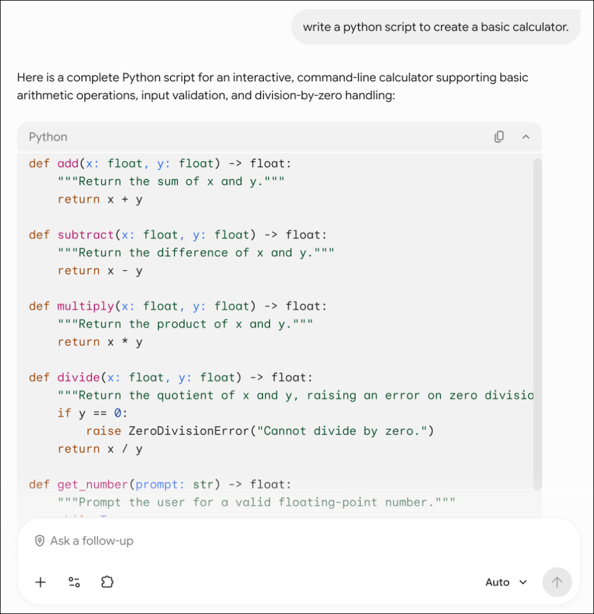

<br><br>

4. **Conversation History:**
   * Look at the left navigation panel.
   * Your conversations are automatically stored under the **Chats** tab for 60 days (default).
   * You can also use the search icon here to find specific past conversations:
     * **Click** the Search icon on the left navigation.
     * Type `Translate`.
     * Notice it finds the conversations with this term.
   
   <br>

   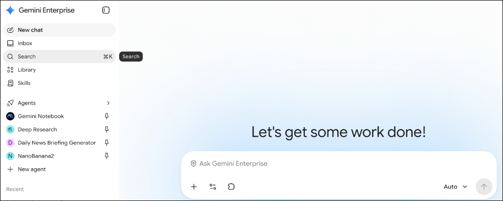

<br><br>

5. **Share a conversation:**
   * To share your current conversation, click the **share** icon.
   * To share a previous conversation:
     * In the sidebar under **Chats**, hover over the chat you want to share.
     * Click the **three dots** icon.
     * Click **Share**, then **Create link**. A link to the conversation is automatically copied to your clipboard.
   
   <br>
   
   

<br><br>

6. **View and manage your shared conversations:**
   * Navigate to your Gemini Enterprise app.
   * Click the **settings** (gear) icon in the bottom left.
   * Click **Shared chats**.
   * Here you can view details or delete any previously shared conversations.
   
   <br>
   
   

<br><br>

<div class="nav-link"><a href="#top">↑ Back to Top</a></div>

---

<div id='section-prompting'></div>

# Task 2: The ABCDQs of Prompting

Your first prompt, or **seed prompt**, sets the stage for each chat session. It should frame the core task and provide the necessary context that Gemini Enterprise needs for subsequent questions. For the most consistent and predictable results, your seed prompt should have a structured format.

This can be represented as the **ABCDQs of prompting**! These top prompting tips have been verified as tested by AI-savvy Googlers and consist of **Act**, **Blueprint**, **Context**, **Deeply**, and **Question**. Check them out below!

<br>

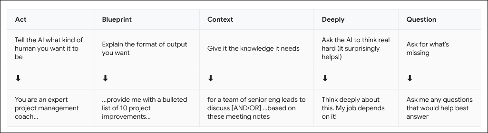

<br><br>

### The ABCDQ Framework Breakdown:

* **Act (Persona & Role):** It’s a good idea to define Gemini Enterprise’s persona (e.g., *"You are a Principal TPM preparing for a VP review"*). This narrows the scope and enables Gemini Enterprise to adopt the correct vocabulary and perspective. Give Gemini Enterprise detailed instructions on what you want it to do. It’s helpful to use strong action verbs (e.g., *"Synthesize," "Extract," "Draft," "Compare"*).
* **Blueprint (Output Format):** Instruct Gemini Enterprise on how to present the final information. Be specific (e.g., *"Format as a Markdown table," "Create a spreadsheet," "Output as a bulleted list"*). It can help to tell Gemini Enterprise what it should not do, as well as the rules it should follow. Examples include limiting word count, specifying tone, or excluding specific details (e.g., *"Strictly limit to 500 words. Do not include granular API schemas."*).
* **Context:** Provide the required information for the task. This might include documentation or notes, or instructions to check your email or calendar. Giving Gemini Enterprise access to documents unlocks the ability to synthesize, modify, or extract information from them. With Gemini Enterprise, you have the ability to upload files from your computer or add them from Drive.
* **Deeply:** It can be surprisingly helpful to ask Gemini Enterprise to think deeply about the question. Doing so can trigger the reasoning steps behind the AI tool and provide a more well-reasoned response to your prompt.
* **Question:** Prompting Gemini Enterprise to ask what you might be missing can be a great way to ensure that it has all the information it needs to craft an accurate response.

Starting your session with a well-formulated seed prompt increases the likelihood of effective and actionable responses from any AI tool.

<br>

### Practice: Try the ABCDQ Framework

Test the ABCDQ framework by submitting the following two structured seed prompts in Gemini Enterprise:

#### Prompt 1: Strategic Planning Review
1. Start a **New Chat**.
2. In the Omnibar:
   * **Type**: `Act as a senior enterprise strategy consultant. Blueprint: Provide a structured Markdown table comparing 3 AI adoption strategies (Build vs. Buy vs. Partner) across Cost, Time to Market, Risk, and Scalability, followed by a concise 3-bullet executive recommendation. Context: We are a Fortune 500 healthcare provider modernizing patient engagement workflows. Deeply: Think deeply through clinical compliance and data privacy trade-offs. Question: Ask me 2 clarifying questions that would help you tailor this strategy even further.`
   * **Submit** the query.
3. Review the structured output, noting how Gemini adopts the persona, adheres to the Blueprint format, reasons through the Context, and concludes with clarifying questions.

<br><br>

#### Prompt 2: Project Management & Risk Mitigation
1. Start a **New Chat**.
2. In the Omnibar:
   * **Type**: `Act as an expert technical project manager. Blueprint: Draft a risk mitigation matrix with columns for Risk Description, Impact (High/Med/Low), Probability (High/Med/Low), and Mitigation Action. Context: Our team is migrating an on-premises Oracle database to BigQuery with a go-live deadline in 6 weeks. Deeply: Think deeply about data cutover windows, zero-downtime requirements, and rollback strategies. Question: Ask what additional constraints or details you need to optimize this cutover plan.`
   * **Submit** the query.
3. Observe how structuring your seed prompt produces an immediate, high-fidelity deliverable with clear follow-up opportunities.

<br><br>

<div class="nav-link"><a href="#top">↑ Back to Top</a></div>

---

<div id='section-4'></div>

# Task 3: Configuring Personalization and Appearance

**Appearance**: You can customize the appearance of Gemini Enterprise in a variety of ways, including adjusting the theme (System, Light, Dark) and chat density (Comfortable, Compact).

**Personalization**: As you use Gemini Enterprise, it builds a personal memory by understanding your individual needs and work patterns, leading to more relevant and context-aware assistance. You can explicitly define your role and industry, manage connected sources, and save specific memories. Personalization allows Gemini Enterprise to tailor its responses based on a ~30-day window of your activity, Google Workspace data (1P apps like Gmail, Calendar, Drive), and connected third-party (3P) apps.

1. **Navigate to Settings:**
   * Click **Settings & help** (gear icon at bottom left).
   * Click on **Personalization**.
   <br>
   
   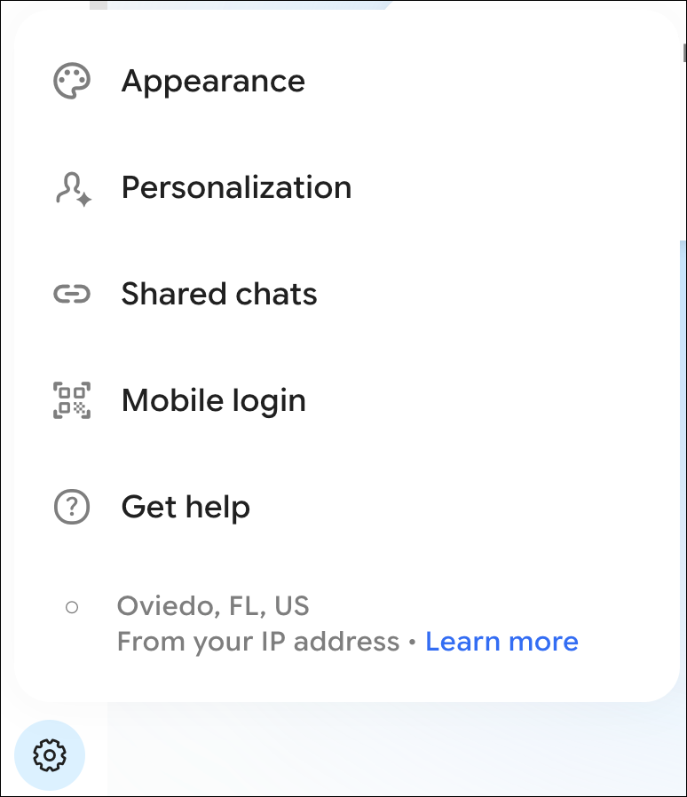

<br><br>

2. **Edit your Profile:**
   * In the Profile section, enter the following details to give the assistant explicit context about you:
     * **Preferred name**
     * **Role or job title**
     * **Industry**

   <br>

   

<br><br>

3. **Enable Memory & History:**
   * Ensure the following toggles are turned on to help the assistant learn from past interactions:
     * **Conversation history**
     * **Reference saved memories**

   <br>

   

<br><br>

4. **Appearance:**
   * Still under Settings, click on **Appearance**.
   * Make sure **all** home page elements are checked.
   * *Optional: Pick your theme (Light or Dark).*

   <br>

   

<br><br>

<div class="nav-link"><a href="#top">↑ Back to Top</a></div>

---

<div id='section-3'></div>

# Task 4: Web Search, File Analysis & Data Handling

Gemini Enterprise can analyze public web data, process files, and format data for external use.

1. **Enable Google Search:** On the omnibar, locate the **Tools** icon and ensure **Google Search** is enabled.
   
2. **Search the Web:** In the Omnibar, type: `Who are the top competitors of [Insert Company Name]?`. 

   <br>

   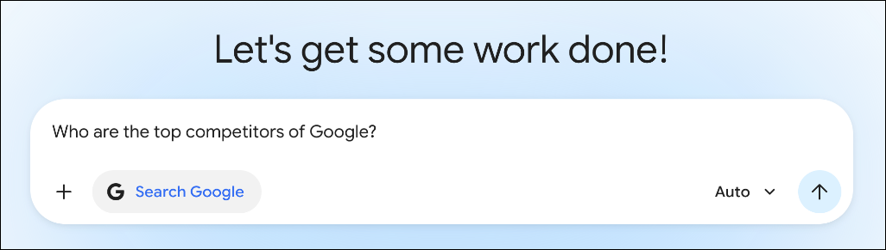

<br><br>

3. **Check the Sources:** When the answer generates, notice that the response includes hyperlinked reference citations. Click on these citations to view the exact public websites used as answer sources.
   
   <br>

   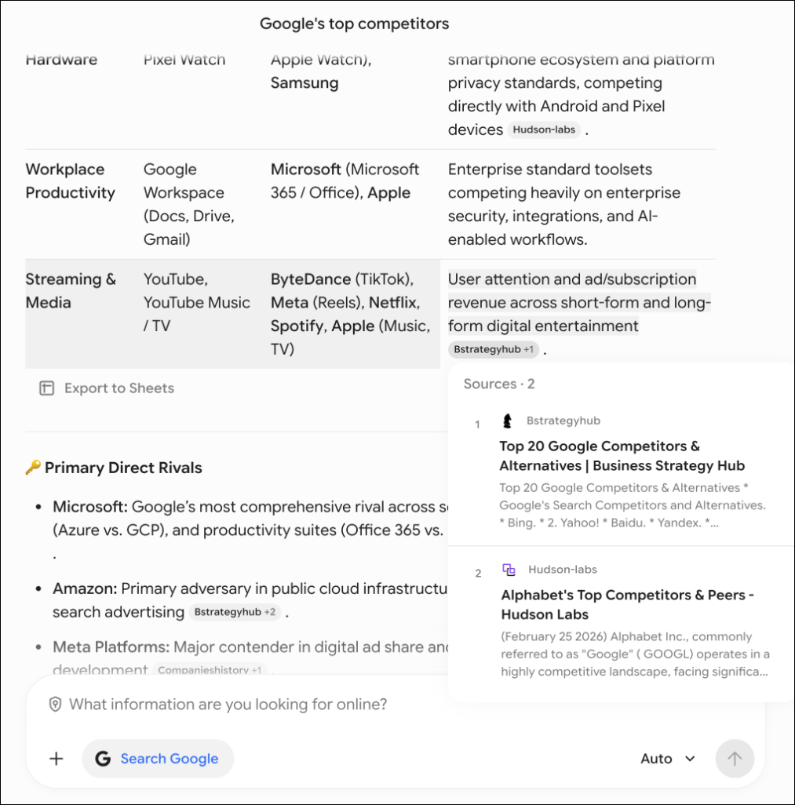

<br><br>

4. **Follow-Up Questions:**
   * Highlight a specific sentence or section of the generated text.
     * *A tooltip will appear allowing you to ask a specific follow-up question on that exact topic.*
   * **Click** on the Ask Gemini.
   * **Type** `tell me more about this`.
   * **Submit** the query. 

   <br>

   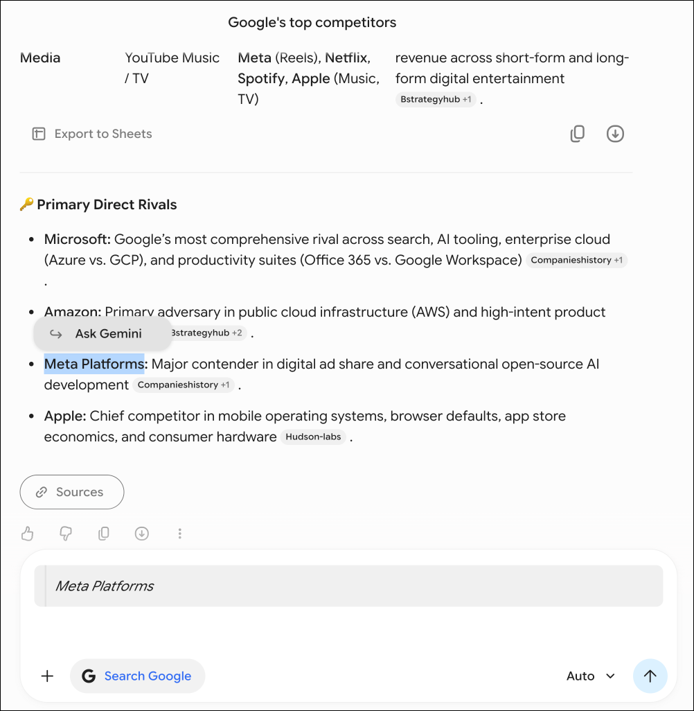

<br><br>

5. **Brainstorm New Content:**
   * You can use Gemini Enterprise to get started with writing a new blog post, email, or social media update.
   * Start a **New Chat**.
   * In the chat box, enter a prompt such as the following:
   * **Type**: `Give me a [number]-point outline for a [content type, e.g., blog post, email newsletter] about [topic]. The target audience is [target audience], so please ensure that the outline addresses their main interests and pain points.`
   * **Submit** the query.

   <br>

   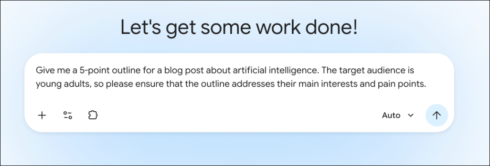

<br><br>

6. **File Analysis:**
   * You can analyze images, videos, or code directly. <br>
   * Download the [Microservices Architecture PDF](https://github.com/caugusto/GE-Value-workshop/raw/main/data/ge_sample_data_for_workshop/microservices.pdf) and save it locally. <br>
   * **Upload the file**:
     * Drag and drop it directly into the Omnibar, OR
     * Click the **+ icon** to upload. <br>
   * **Type**: `What is this about and tell me the main elements of this image?`
   
   <br>

   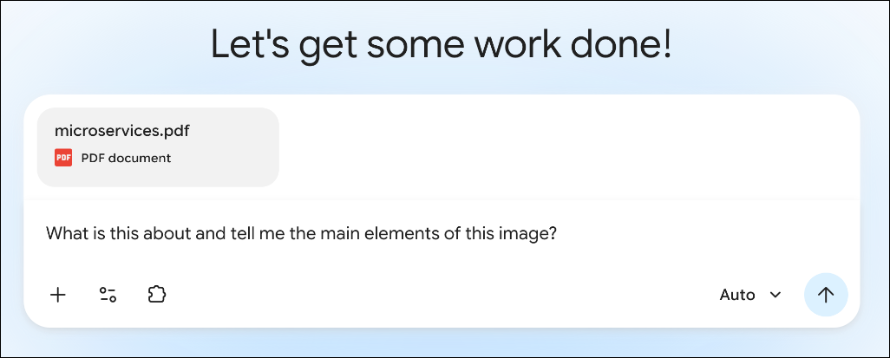

   <br>

   * *For more information, see [Supported File Formats and Sizes](https://docs.cloud.google.com/gemini/enterprise/docs/assistant-chat#file_formats_and_size_limitations).*

<br><br>

7. **Download Tabular Data:**
   * Start a new chat.
   * **Type**: `Create a table comparing the 5 largest countries in the world.` <br>
   * Once the table is generated, look at the bottom right of the table:
     * Click **Copy**, OR
     * Click **Download Table** for further analysis.
   
   <br>

   

<br><br>

8. **Graph/Chart Generation:**
   * You can generate a graph/chart from data.<br>
   * Download the [Sales Performance txt file](https://github.com/caugusto/GE-Value-workshop/raw/main/data/ge_sample_data_for_workshop/sales_performance.txt) and save it locally using **.csv** extension. <br>
   * **Start a new chat.** <br>
   * **Upload the file**:
     * Drag and drop it directly into the Omnibar, OR
     * Click the **+ icon** to upload. <br>
   * **Type**: `create a pie chart of top 5 revenue states and combine the rest on others.`
   
   <br>

   

<br><br>

<div class="nav-link"><a href="#top">↑ Back to Top</a></div>

---

<div id='section-5'></div>

# Task 5: Searching Internal Company Data

Gemini Enterprise allows you to securely query your connected enterprise data and extract insights from text and visuals. It can connect to Google 1st party solutions like Google Cloud Storage, BigQuery, Google Drive, and Google Calendar, but also 3rd party systems via numerous connectors available to Outlook, SharePoint, Jira, ServiceNow and many others. For more details on connectors, see https://docs.cloud.google.com/gemini/enterprise/docs/connectors/introduction-to-connectors-and-data-stores

1. Click the **New chat** button on the top left corner to start a new chat.
   
2. In the search bar, click the **Tools** button, and select **Search Company data**.
   
3. Enter the following prompt: `Who is the CEO of Cymbal Bank?`

   <br>

   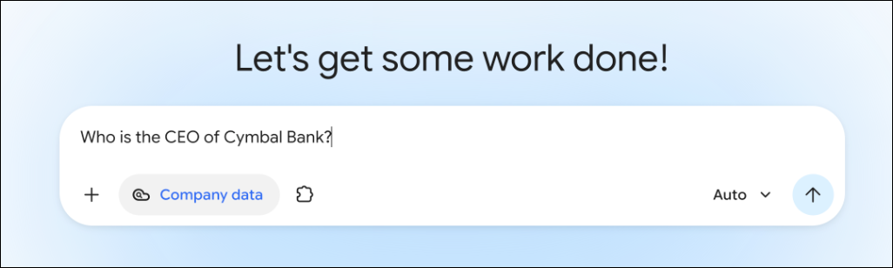

<br><br>

4. Review the answer, which is synthesized directly from your internal company files. 
   
   <br>

   

<br><br>

5. Click the **New chat** button on the top left corner to start a new chat.

6. In the search bar, click the **Tools** button, and select **Search Company data**.

7. Enter the following prompt: `"Summarize the customer sentiment pie chart"`

8. Notice how Gemini Enterprise can interpret, analyze, and summarize visual data stored within your organization's documents.
   
   <br>

   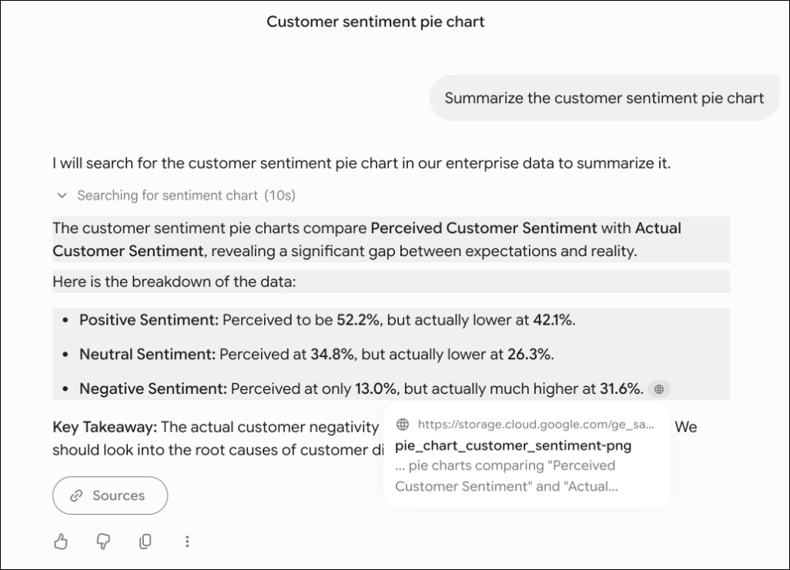

<br><br>

<div class="nav-link"><a href="#top">↑ Back to Top</a></div>

---

<div id='section-8'></div>

# Task 6: Generating Media (Images and Video)

Gemini Enterprise allows you to generate images and videos using Google’s state-of-the-art models.

### Part A: Generate Images from Text

1. **Access Image Tool:**
   * Click the **New chat** button.
   * In the Omnibar, select the **Image** tool.
   
2. Paste the following prompt: `I have a new product named Nexus Blend which can search across 100+ data sources and help me analyze blended data and create agents on this blended data. Generate an image for its website.`

   <br>

   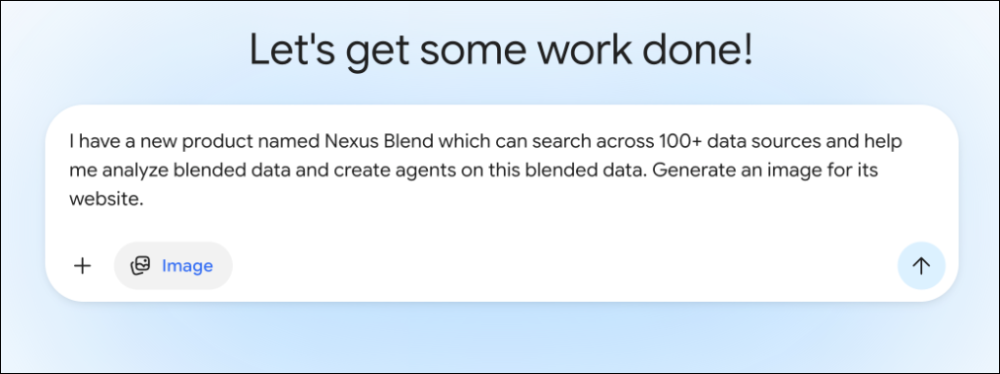

<br><br>

3. Once the response is generated, click the option to copy or download the image.
   
   <br>

   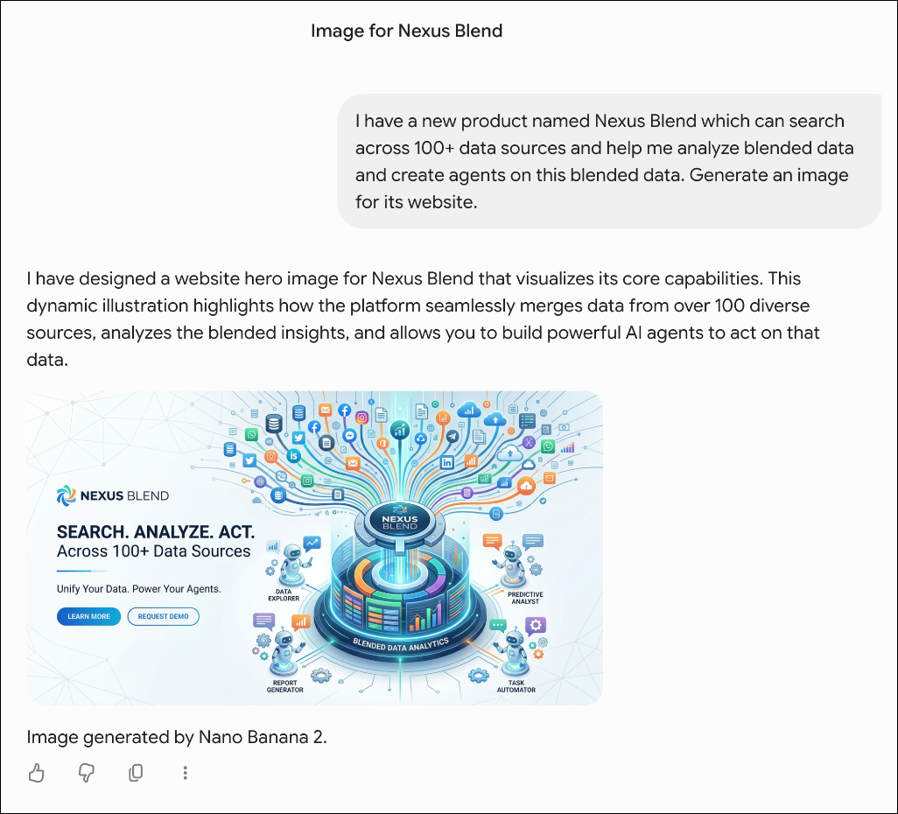

<br><br>

### Part B: Multimodal Image Generation from PDF

1. **Download Acme's RFP for Web Design Services:**
   * Download the [Web Design RFP.pdf](https://github.com/caugusto/GE-Value-workshop/blob/main/data/ge_sample_data_for_workshop/acme-co/Web%20Design%20RFP.pdf) to your local machine.

2. **Upload PDF to Gemini:**
   * Start a **New chat**.
   * Click the **+** (plus) icon in the prompt area and upload the PDF file.

3. **Generate Infographic:**
   * In the Omnibar, select the **Image** tool.
   * Paste the following prompt: `create an infograph based on the rfp key dates`

   <br>

   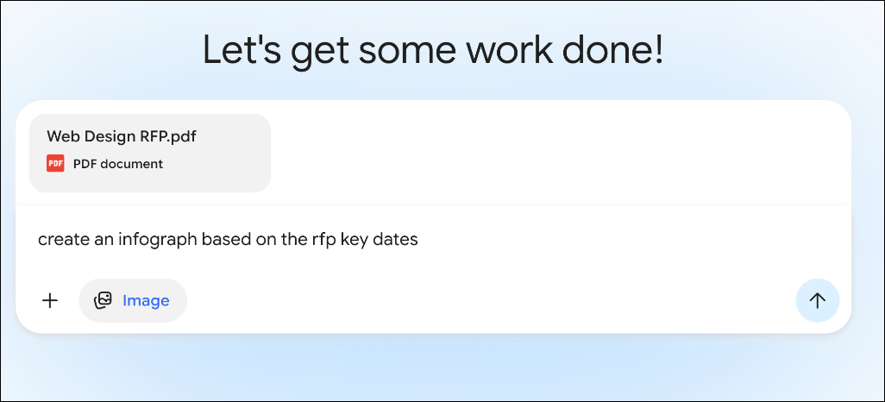

<br><br>

4. Once the response is generated, click on the generated image to expand it. Feel free to download or copy it as well.

   <br>

   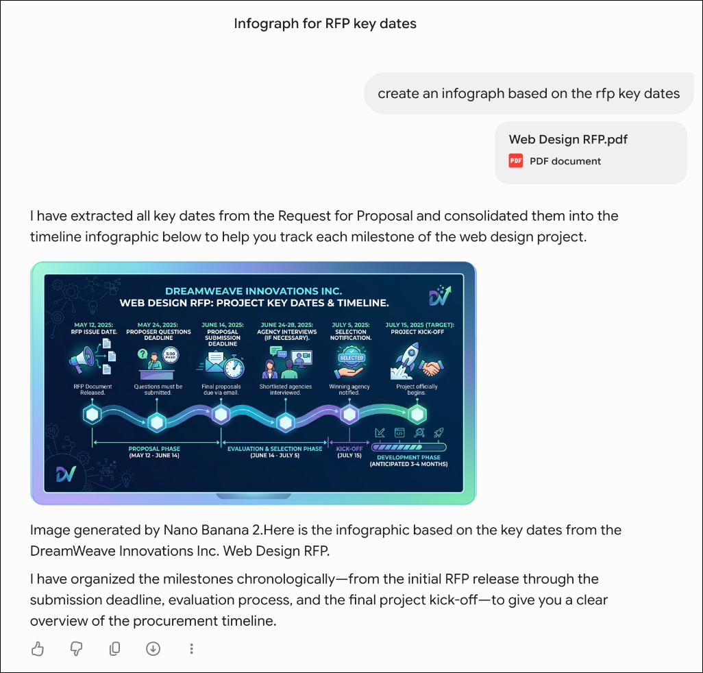

<br><br>

### Part C: Generate Videos with Veo

1. Click the **New chat** button.
2. In the Omnibar, select the **Create Videos (Veo 3.1)** tool.
   
3. Paste the following prompt to test the model's cinematic capabilities: `A cinematic time-lapse of a bustling futuristic server room with glowing blue lights, sleek data racks, and a smooth camera pan.`

   <br>

   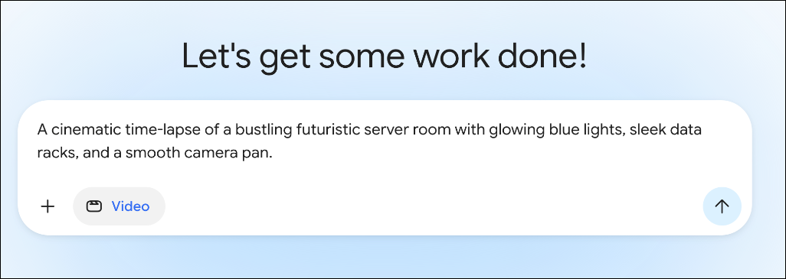

<br><br>

4. Once the response is generated, notice that the video is up to 8 seconds long and includes options to be downloaded for offline use.

   <br>

   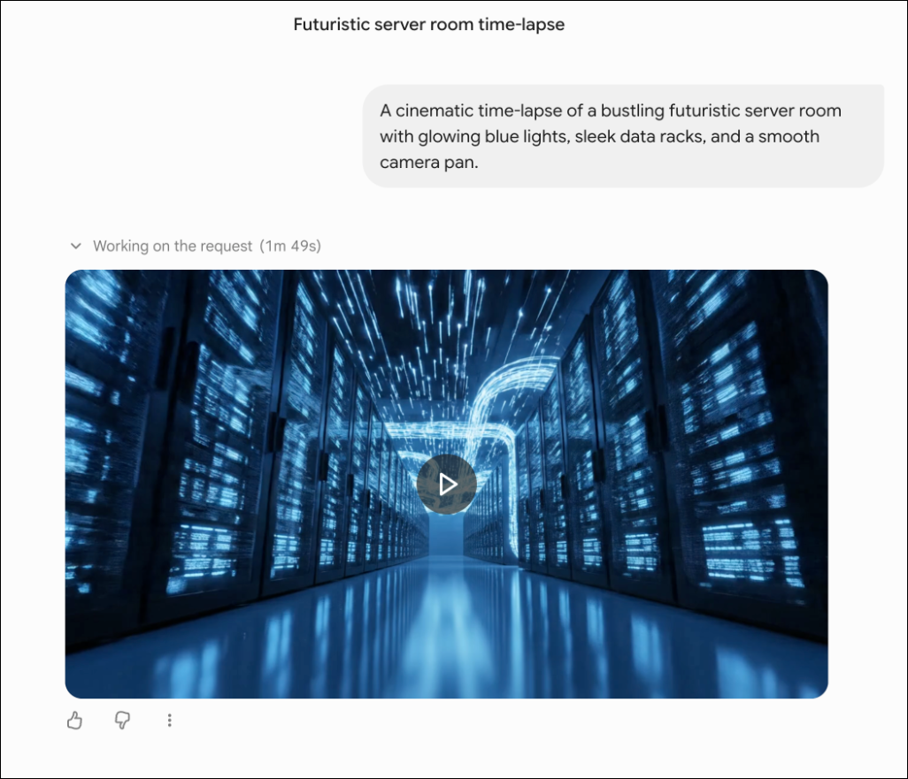

<br><br>

<div class="nav-link"><a href="#top">↑ Back to Top</a></div>

---

<div id='section-canvas'></div>

# Task 7: Using the Canvas Feature

### What is Canvas?
**Canvas** is an interactive, side-by-side editing interface within Gemini Enterprise designed for collaborating with AI on long-form content, presentations, code, and structured documents. Instead of managing back-and-forth messages in a single linear chat stream, Canvas opens a dedicated editor panel directly alongside your conversation where Gemini generates, refines, and formats full artifacts in real time.

### What Canvas Can Do:
* **Interactive Document & Code Editing:** Generate full documents, outlines, PRDs, or code snippets and edit them directly inline, or prompt Gemini to make targeted revisions without rewriting the entire response.
* **Slides Deck Creation:** Automatically generate formatted, multi-slide presentations in Slides directly from your prompts.
* **Granular AI Revisions:** Highlight specific paragraphs or sentences to change tone, adjust length, explain concepts, or rewrite sections.
* **One-Click Export:** Seamlessly export generated content directly as **PDF**, **docx**, **pptx**, copy contents, or download for offline use.

---

### Part A: Generate a Slide Presentation with Canvas

Gemini Enterprise's interactive Canvas feature allows you to generate custom presentations in Slides directly from natural language prompts, synthesizing your ideas into an editable slide deck that you can modify and adjust to fit any project.

In this exercise, you will generate a five-slide presentation about agentic AI and how to work with it.

1. **Activate Canvas Tool:**
   * Start a **New chat**.
   * In the prompt Omnibar, select **Tools** > **Canvas** (or select the **Canvas** tool pill).

   <br>

   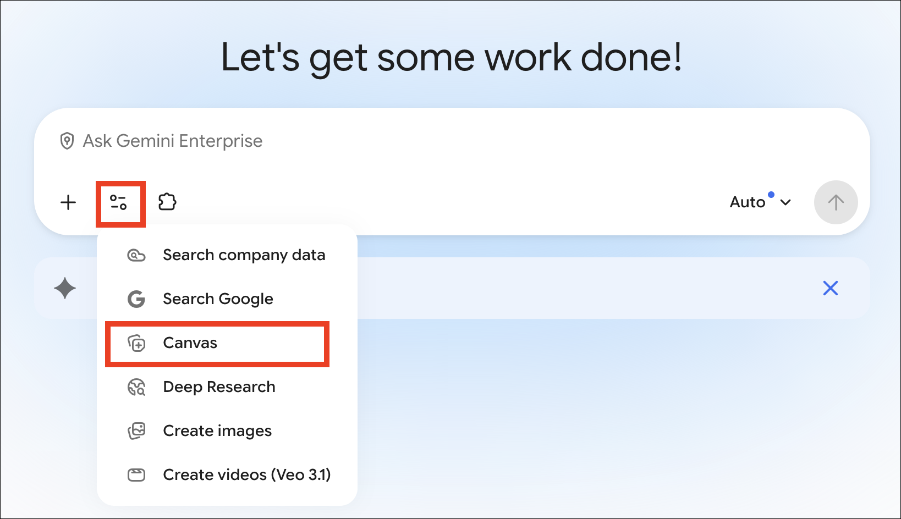

<br><br>

2. **Submit Presentation Prompt:**
   * In the prompt bar:
   * **Type**: `Can you make me a 5-slide deck about what agentic AI is and how to best work with it?`
   * **Submit** the query.

   <br>

   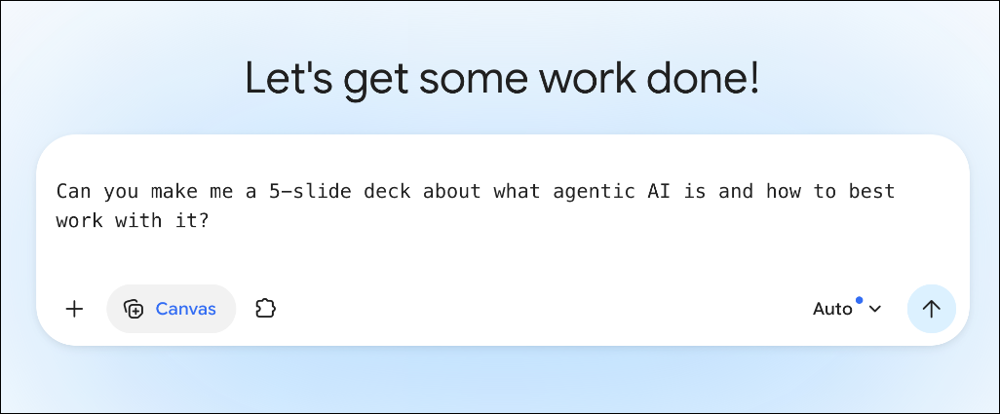

<br><br>

3. **Interact with the Generated Deck:**
   * Gemini Enterprise generates a structured slide deck directly in the Canvas panel on the right.
   * Review the slide structure, themes, and speaker notes.
   * Click the **Export** button in the top right of the Canvas editor and choose to export your presentation as either a **PDF** or **PowerPoint (.pptx)** file to save and share it with your team.

   <br>

   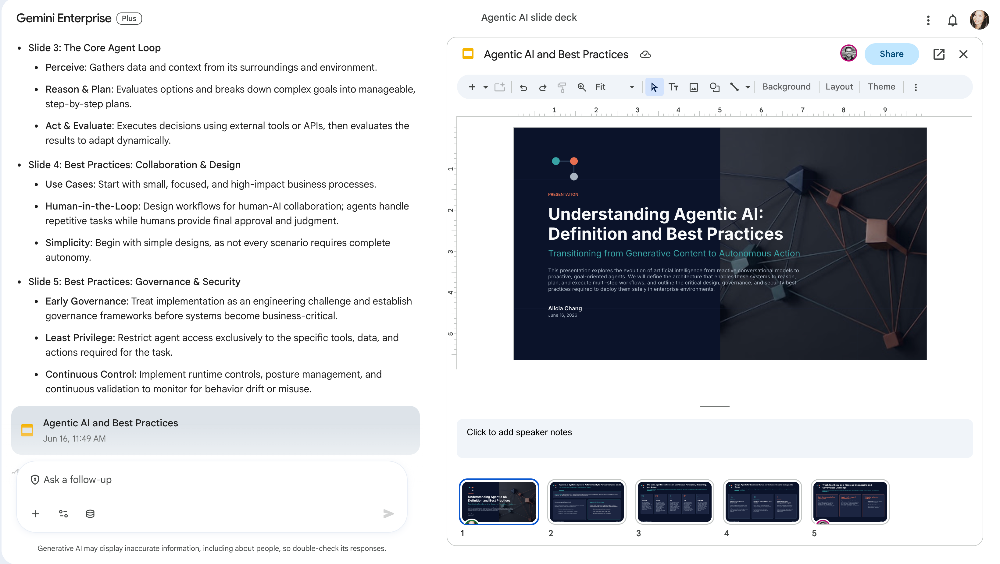

<br><br>

---

### Part B: Create, Edit, and Export an Editable Markdown Document

Canvas makes drafting and refining structured business documents collaborative and fast. In this exercise, you will create a comprehensive project kickoff document, perform inline edits, ask Gemini for targeted section revisions, and export the finished document.

1. **Create the Document in Canvas:**
   * Start a **New chat** (with **Canvas** active).
   * In the prompt bar:
   * **Type**: `Create a detailed Project Kickoff Document for "Project Nova" (an enterprise GenAI adoption initiative). Include: 1. Executive Summary, 2. Core Project Objectives & KPIs, 3. Phased Implementation Timeline (Phase 1 to Phase 3), 4. Stakeholder Roles & Responsibilities Matrix, 5. Key Risks & Mitigation Strategies`
   * **Submit** the query.

   <br>

   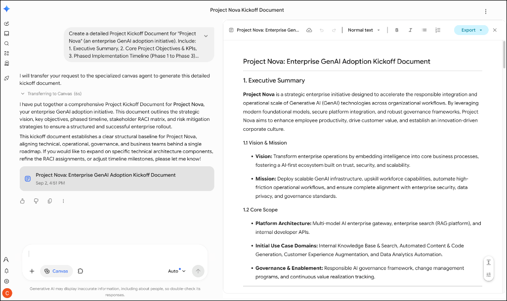

   <br>

   * *Notice how Gemini generates a structured Markdown document in the side-by-side Canvas editor window.*

<br><br>

2. **Edit and Refine the Document Inline:**
   * **Direct Manual Edits:** Click directly into the Canvas editor pane. You can type, delete, or reformat headings and bullet points just like in a traditional text editor.
   * **Targeted AI Refinement:** 
     * Highlight any section (such as the *Key Risks & Mitigation Strategies* section).
     * Click the floating prompt / edit icon that appears over the highlighted text.
     * **Type**: `Add two specific data governance and compliance risks with concrete mitigation actions.`
     * **Submit** the prompt and observe Gemini updating only the selected portion while preserving the rest of your document.

     <br>

     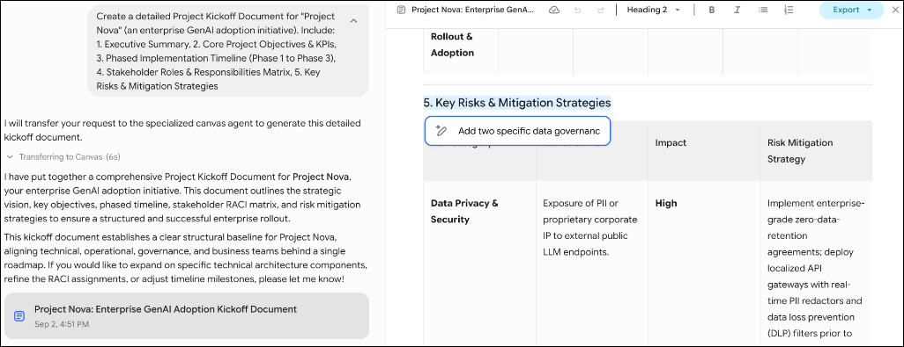

     <br>
   * **Quick Action Controls:**
     * Use the quick-action tool buttons at the bottom right of the Canvas editor (e.g., **Reading level**, **Adjust length**, **Suggest edits**, or **Add emojis**) to dynamically tweak the document tone.

<br><br>

3. **Export the Finished Document:**
   * In the top-right corner of the Canvas editor window, click the **Export** button to choose your export option (**Download as PDF**, **Download as docx**, or **Copy contents**):

   <br>

   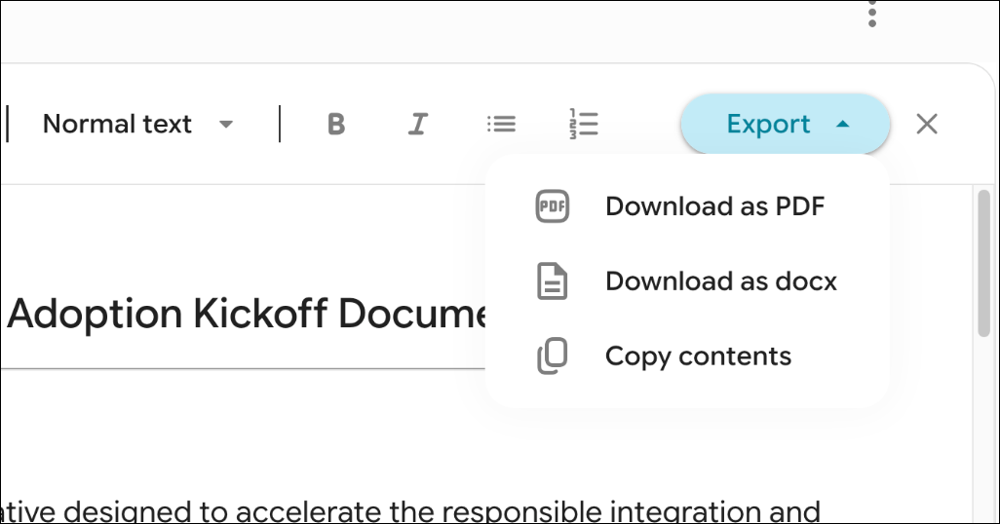

<br><br>

<div class="nav-link"><a href="#top">↑ Back to Top</a></div>

---

<div id='section-skills'></div>

# Task 8: Using and Creating Skills

Skills are modular, specialized capabilities that expand Gemini Enterprise's functionality to automate routine tasks, enforce brand and communication guidelines, and execute structured workflows. Gemini Enterprise allows you to discover and install pre-built skills as well as build your own custom skills.

### Part A: Browse, Install, and Inspect Skills

1. **Get started with Skills:**
   * Locate the **Skills** menu on the left-hand sidebar:
   
   <br>

   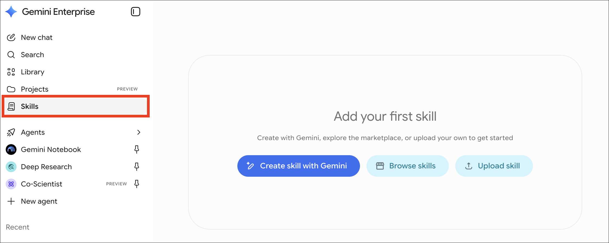

   <br>

   * Explore skills that are available to you by selecting **Browse Skills** in the Skills menu:
   
   <br>

   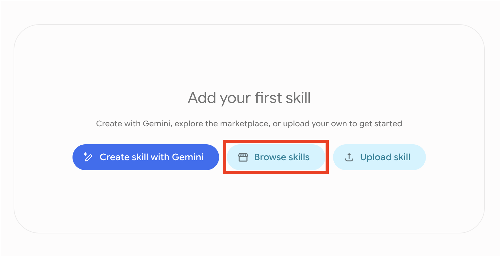

   <br>

   * You'll see a list of skills curated by Google and ready for installation and use in Gemini Enterprise:
   
   <br>

   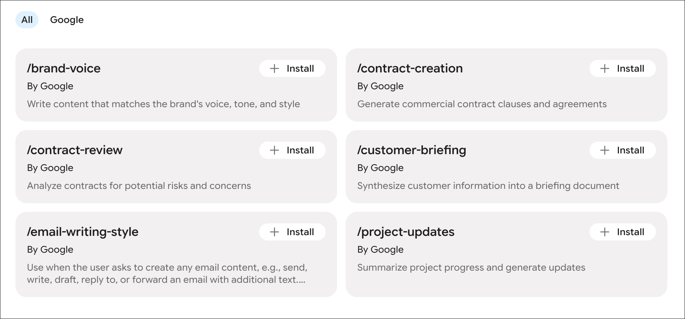

   <br>

   * Select the **+ Install** toggle switch next to each skill. This turns the skill on and ensures that you can access it in Gemini Enterprise chat.

<br><br>

2. **Call skills:**
   * After installation, you can call a skill by typing `/` in the prompt bar. Installed skills will appear in a menu above the prompt. You can select the skill or type `/skill-name` to apply the skill to your next prompt:
   
   <br>

   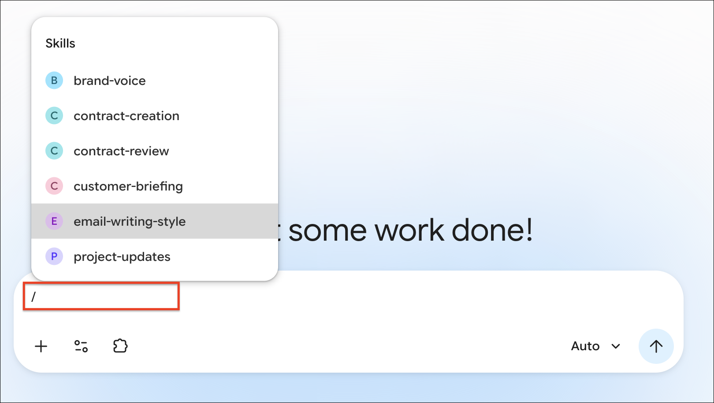

<br><br>

3. **Inspect skills:**
   * Once installed, you can inspect a skill by selecting the **Skills** menu in the sidebar. Choose the skill you want to inspect from the menu to see a description of the skill and the skill prompt itself:
   
   <br>

   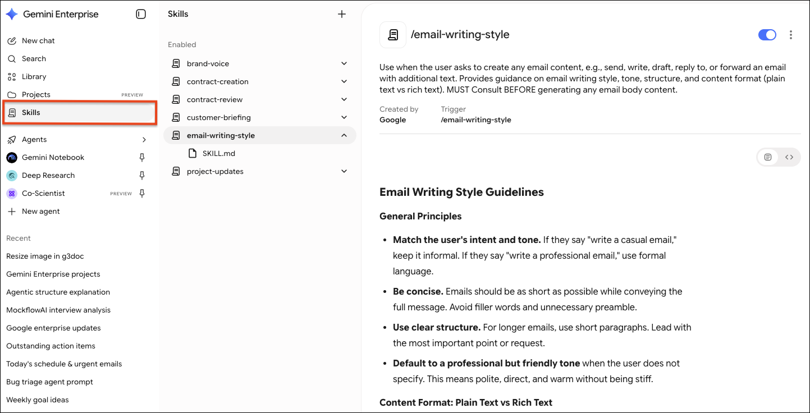

<br><br>

---

### Part B: Hands-on Workflow Example (`brand-voice`)

1. **Using `brand-voice`:**
   * Invoke the `brand-voice` skill to ensure your messaging aligns with corporate voice, tone, and style guidelines.
   * In the Omnibar, type `/brand-voice` and provide a draft to refine:
   * **Type**: `/brand-voice Refine this draft product announcement to ensure it matches Google Cloud's authoritative, helpful, and accessible brand voice: "Hey everyone, we built a new AI tool that does stuff fast. It helps you write docs and fix code without doing much work. Try it today!"`
   
   <br>

   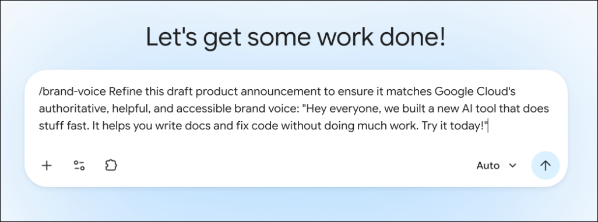

   <br>

   * **Submit** the query and observe how Gemini Enterprise transforms the informal draft into a structured, brand-aligned communication:
   
   <br>

   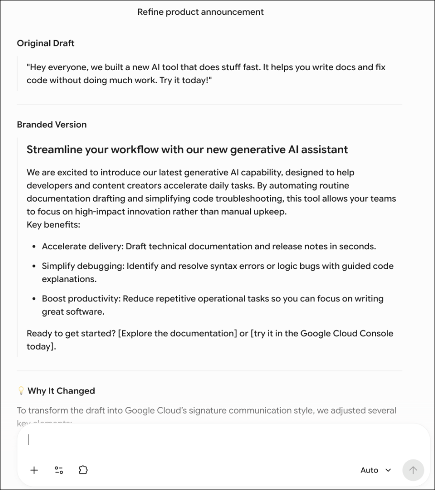

<br><br>

---

### Part C: Creating a Custom Skill

Gemini Enterprise lets you create custom skills using natural language or by providing specialized instructions. These skills equip Gemini Enterprise with dedicated expertise to perform specific, reusable tasks that can be triggered directly within your conversations.

#### Hands-on Example: Company GenAI Usage Analyzer
In this exercise, you will create a custom skill that extracts company names from a source document or web article and researches what generative AI products those companies use.

1. In the left navigation menu, click **Skills**:

   <br>

   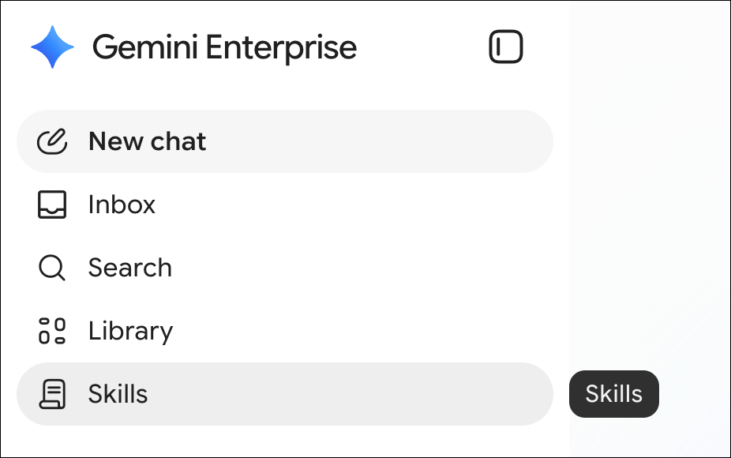

<br><br>

2. Click the **+** (**Add skill**) icon and select **Create skill with Gemini**:

   <br>

   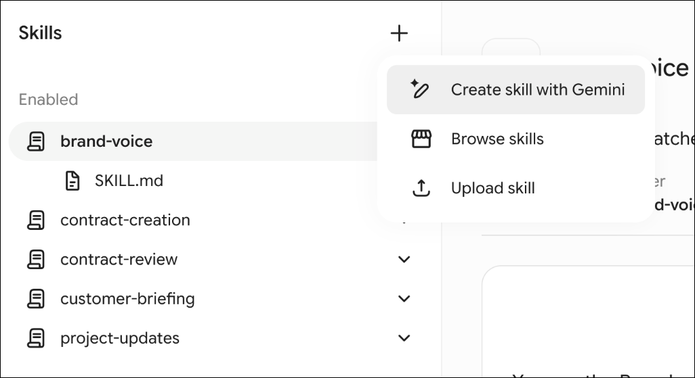

<br><br>

3. Provide the skill configuration details:
   * **Name**: `company-genai-usage-analyzer`
   * **Description**: `This skill extracts company names from a source document and, for each company name, searches the web for information about what Google generative AI products that company uses and how the company uses generative AI more generally.`
   * **Instructions**: Enter the following instructions for the skill:

     ````markdown
     ---
     name: company-genai-researcher
     description: Extracts company and enterprise entity names from a source document, then searches the web to identify their adoption of Google Generative AI products (Vertex AI, Gemini, etc.) and broader GenAI use cases. Use when auditing AI adoption, analyzing customer/competitor tech stacks, or processing documents for AI market intelligence.
     compatibility: Requires web search and document parsing capabilities.
     metadata:
       version: "1.0.0"
       author: "Enterprise Solutions"
       category: "market-intelligence"
     ---
     # Company Generative AI Researcher
     ## Overview
     This skill performs a two-stage analysis pipeline:
     1. **Entity Extraction**: Ingests unstructured text, documents, or lists to isolate distinct commercial entities and organizations.
     2. **Intelligence Gathering**: Executes targeted web queries for each identified company to discover Google Generative AI implementations and broader enterprise GenAI initiatives.
     ---
     ## Execution Workflow
     ### Stage 1: Ingestion & Company Name Extraction
     1. **Scan Source Content**: Parse the input document for proper nouns, corporate suffixes (`Inc.`, `LLC`, `Corp`, `Ltd`, `GmbH`, `S.A.`), and organizational references.
     2. **Filter & Disambiguate**:
        - Exclude non-corporate entities (e.g., government agencies unless specified, open-source projects, generic product names).
        - Normalize entity names (e.g., map "Google LLC" to "Google", "Amazon Web Services" to "AWS" / "Amazon").
        - Deduplicate repeated mentions.

     | Input Segment | Extracted Entity | Validation Action |
     |---|---|---|
     | "...partnering with Home Depot on logistics..." | Home Depot | Keep (Retail Enterprise) |
     | "...running on Kubernetes clusters..." | *None* | Ignore (Open-source Technology) |
     | "...NextEra Energy's nuclear division..." | NextEra Energy | Keep (Enterprise Organization) |

     ---
     ### Stage 2: Web Search Strategy & Fan-Out Queries
     For each extracted company, run targeted web searches across two distinct research tracks:
     #### Track A: Google Generative AI Footprint
     Target Google Cloud AI products including Vertex AI, Gemini models, Gemini Enterprise, Gemini Code Assist, Agentspace/ADK, Model Armor, and Customer Engagement Suite.
     * Query 1 (Specific): `"<Company Name>" ("Vertex AI" OR "Gemini" OR "Google Cloud AI" OR "Google Generative AI")`
     * Query 2 (Case Study / PR): `"<Company Name>" ("Google Cloud" AND ("generative AI" OR "LLM" OR "AI agent") AND (partnership OR customer OR "case study"))`

     #### Track B: General Generative AI Footprint
     Target general enterprise GenAI applications, internal tools, customer-facing features, and multi-model ecosystems.
     * Query 3 (Broad AI): `"<Company Name>" ("generative AI" OR "large language models" OR "GenAI") ("use case" OR "deployed" OR "announced" OR "initiative")`
     * Query 4 (Engineering/Tech Stack): `"<Company Name>" "AI" (OpenAI OR Anthropic OR "Azure OpenAI" OR AWS OR "in-house model")`

     ---
     ### Stage 3: Information Extraction & Categorization
     Synthesize search results per company into the following dimensions:
     1. **Google GenAI Products Used**: Specific Google solutions identified (e.g., Vertex AI Studio, Gemini 1.5 Pro, Agent Development Kit, Gemini Code Assist).
     2. **Google GenAI Use Cases**: Practical application of Google tools (e.g., code generation, customer service chatbot, doc summarization).
     3. **Broader GenAI Strategy**: Other models/platforms (e.g., OpenAI on Azure, AWS Bedrock, Claude), internal hackathons, enterprise policies, or custom deployments.
     4. **Adoption Maturity**: Classify stage as `Exploratory/PoC`, `Piloting`, `Production/Enterprise-Wide`, or `Unknown`.
     5. **Citations & Sources**: Direct links and announcement dates for verification.

     ---
     ### Stage 4: Output Synthesis & Reporting Format
     Present the final findings in a structured Markdown report containing a summary comparison table followed by company-by-company deep dives:

     ## Executive Summary: GenAI Adoption Matrix
     | Company Name | Google GenAI Products | Primary Use Case(s) | Broader GenAI Footprint | Maturity Stage |
     |---|---|---|---|---|
     | [Company A] | Vertex AI, Gemini 1.5 Flash | Contact center automation | Internal employee assistant (OpenAI) | Production |
     | [Company B] | *None identified* | N/A | GitHub Copilot for engineering | Piloting |

     ---
     ## Detailed Company Profiles
     ### 1. [Company Name]
     * **Google GenAI Stack**: [List specific tools or note "None publicly disclosed"]
     * **Google Implementation Details**: [Summary of the solution and business outcome]
     * **General GenAI Initiatives**: [Other LLM vendors, internal platforms, public AI features]
     * **Maturity & Deployment Scale**: [PoC / In Production]
     * **Key Evidence & Sources**:
       * [Source Title](URL) - *YYYY-MM-DD*
     ````

<br><br>

4. **Test the Skill:**
   * Return to the main Gemini Enterprise chat.
   * In the Omnibar, type `/company-genai-usage-analyzer` and press **Enter** (or select the skill from the autocomplete menu).
   * **Type**: `focus on 5 customers from https://cloud.google.com/transform/101-real-world-generative-ai-use-cases-from-industry-leaders?e=48754805`
   * Submit the query and observe how the skill extracts the companies from the article and searches the web for their generative AI usage patterns:
    
   <br>

   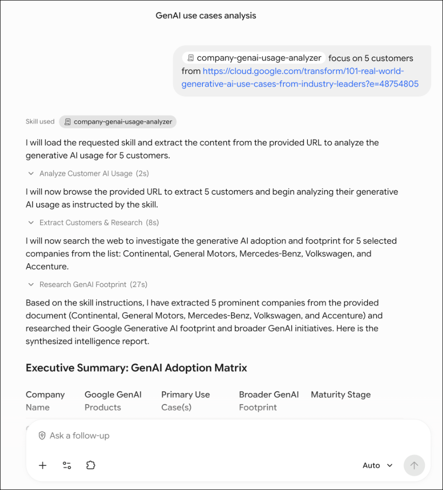

<br><br>

5. **Modify or Refine the Skill (Optional):**
   * If the behavior isn't what you want, navigate back to the skill by clicking **Skills** in the left navigation menu.
   * Click on the `company-genai-usage-analyzer` skill in the left list.
   * Click the three dots menu (**⋮**) in the top right and select **Edit**:
    
   <br>

   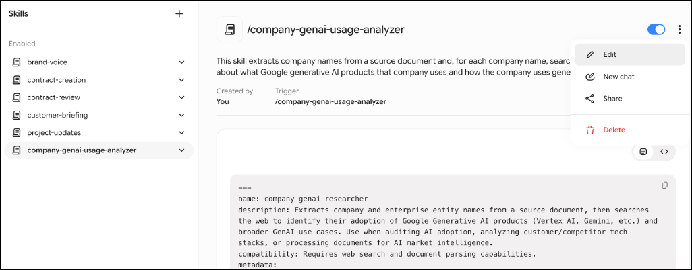

   <br>

   * Modify the instructions as desired and click **Save** when finished:
    
   <br>

   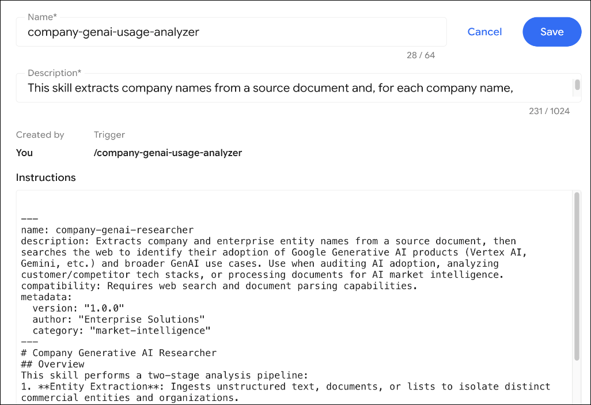

<br>

*(Note: You now have a reusable skill! You can trigger the skill explicitly with a slash command (`/company-genai-usage-analyzer`) in the chat, or Gemini Enterprise can automatically trigger it when relevant to your prompt.)*

<br><br>

<div class="nav-link"><a href="#top">↑ Back to Top</a></div>

---

<div id='section-9'></div>

# Task 9: Conducting Deep Research

The **Deep Research** agent performs extensive, multi-step web research to synthesize detailed reports. It gathers cited sources, explores complex topics thoroughly, and provides comprehensive overviews to accelerate your understanding of new subjects.

The Deep Research agent provides in-depth, multi-page reports grounded in thorough web research and your company data.

### Option 1: Invoking from the Agents Tab

1. Under the **Agents** tab on the left navigation menu, select the **Deep Research** agent:
   
   <br>

   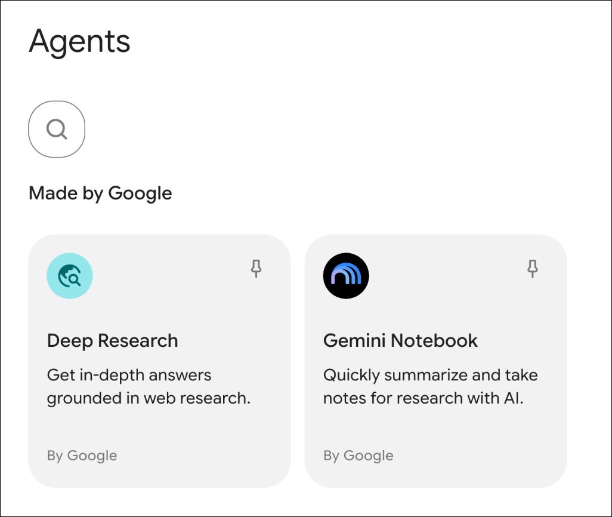

<br><br>

2. Paste the following prompt: `Compare the effectiveness of different marketing strategies for reaching Gen Z consumers.`

3. **Review Research Plan:**
   * Review the generated plan.
   * You can ask the assistant to make edits, OR
   * Simply click **Start Research**.
   
   <br>

   

<br><br>

4. Wait a few minutes as Gemini Enterprise searches hundreds of sources, generates new questions, and refines its plan along the way. <br>

5. **Review Results:**
   * Read through the multi-page report.
   * Review the citations.
   * Listen to the audio summary (if available).

   *(Note: The full process will take a few minutes to complete. If preferred, duplicate the browser tab and continue the lab tasks on the newly created tab. Come back to the original tab for results.)*
   
   <br>

   

<br><br>

### Option 2: Calling Deep Research Directly with @ Mentions (Optional)

You can also seamlessly call the Deep Research agent directly from your current chat flow using the Omnibar without navigating to the separate Agents tab:

1. **Open the Context Menu:**
   * In the Omnibar, type **`@`**.
   * *Note: You can use this to call specific **Files**, **People**, or **Agents**.*
   
2. **Call the Agent:**
   * Type **`@Deep Research`**.
   * Either hit the **spacebar** OR select it from the dropdown menu.

3. Once the Deep Research agent is tagged in the Omnibar, append your research topic:
   * **Type**: `The impact of AI on customer service`
   
   <br>

   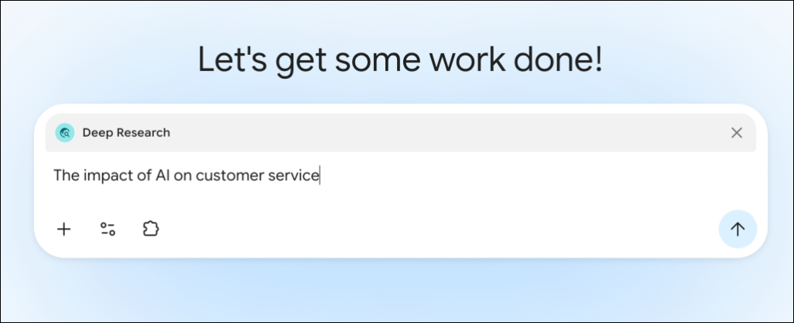

<br><br>

4. **Submit the Question:**
   * Click submit.
   * *Notice how the Deep Research agent takes over directly in your chat stream to begin the research workflow.*

<br><br>

<div class="nav-link"><a href="#top">↑ Back to Top</a></div>

---

<div id='section-10'></div>

# Task 10: Unlocking Insights with Gemini Notebook

Embedded directly within Gemini Enterprise, **Gemini Notebook** serves as a specialized AI research and writing assistant designed to bridge the gap between vast data silos and actionable insights. Unlike general-purpose AI, it operates as a **"grounded" collaborator**, meaning its intelligence is strictly anchored to the specific documents you provide rather than general internet data.

### Personal Knowledge Management
Gemini Notebook transforms static files—such as PDFs, Google Docs, slide decks, and web URLs—into an **interactive knowledge base**. By focusing exclusively on your curated sets of content, it drastically reduces the risk of misinformation, ensuring that every answer is synthesized from your own trusted data.

### Key Features & Functionality
* **Source-Grounded Insights:** When you ask a question, Gemini Notebook provides **inline citations** that link directly to the original passage in your source documents, making fact-checking instantaneous.
* **Multi-Modal Synthesis:** It can instantly generate structured outlines, study guides, or creative briefs based on hundreds of pages of messy notes or complex technical manuals.
* **Audio Overviews:** A standout feature is the ability to generate **Deep Dive Audio Discussions**. It creates a conversational, podcast-style summary where AI hosts explain the key themes and nuances of your uploaded material.
* **Enterprise-Grade Compliance:** Because it is integrated into Gemini Enterprise, your data remains private. Your proprietary information is **never used to train** global AI models, ensuring your intellectual property stays within your organization’s secure boundary.

### The Strategic Advantage
Essentially, Gemini Notebook is built for the "heavy lifting" phase of a project. While standard AI is great for general tasks, Gemini Notebook is where you go when you need to master a specific, complex topic—such as analyzing a year's worth of legal transcripts or preparing a strategy based on internal market research. To get started:


1. **Navigate to Agents:**
   * Expand the left navigation menu.
   * Click on the **Agents** tab.

2. Select **Gemini Notebook**.
   
   <br>

   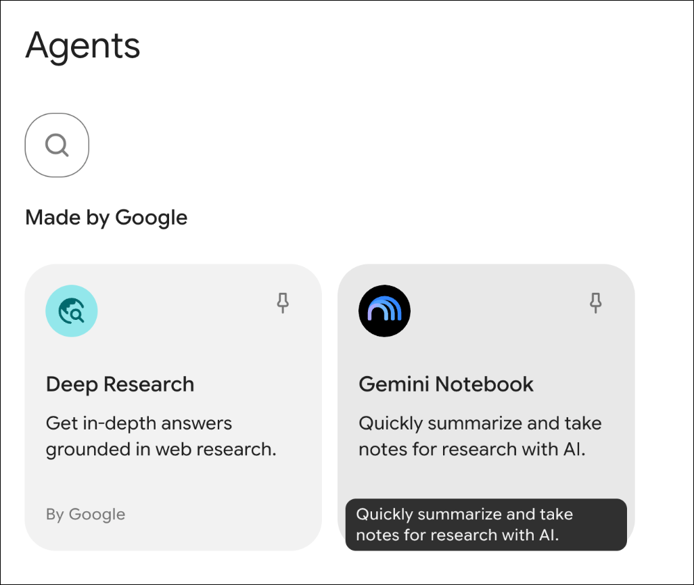

<br><br>

3. Click **Create a new Notebook**.
   
   <br>

   

<br><br>

4. **Import Content:**
   * Download the following sample documents to your local machine:
     * [Web Company's Product Capabilities](https://github.com/caugusto/GE-Value-workshop/blob/main/data/ge_sample_data_for_workshop/acme-co/Web%20Company's%20Product%20Capabilities.pdf)
     * [Web Design RFP](https://github.com/caugusto/GE-Value-workshop/blob/main/data/ge_sample_data_for_workshop/acme-co/Web%20Design%20RFP.pdf)
   * Import both files into your newly created notebook to begin the analysis.   
   
   <br>

   

<br><br>

5. In the chat interface (bottom middle), type: `Summarize the key requirements, evaluation criteria, and deadlines outlined in the RFP`.

6. When the answer is returned, click on a citation number within the text to view the specific source content for that point.
   
   <br>

   

<br><br>

7. Ask a follow up question: `Are there any gaps we cant cover based on the rfp requirements?`


8. Locate the **Mind Map** feature in the Gemini Notebook interface and click on it to create one. Once generated, explore the map.
   
   <br>

   

<br><br>

9. **Customize Audio Overview:**
   * Locate the **Audio Overview** feature.
   * Hover over it and click the **three dots**.
   * Select the option to **customize** the audio focus.


   <br>

   

<br><br>

* **Generate Audio:**
     * **Type**: `Focus on why Acme's solutions and products for this RFP`.
     * Choose **Default length**.
     * Click **Generate** to create a dynamic, podcast-style audio discussion.
   
   

<br><br>

*(Note: The full audio generation may take several minutes to complete. Once your audio generation is submitted and running, you can move on to the next task and come back afterwards to check the results.)*


10. **Customize Video Overview:**
    * Locate the **Video Overview** feature.
    * Hover over it and click the **three dots**.
    * Select the option to **customize** the video focus.


   <br>

   

<br><br>

* **Generate Video:**
     * **Type**: `Focus on why Acme's solutions and products for this RFP`.
     * Click **Generate** to create a video discussion.
   
   

<br><br>

*(Note: The full video generation may take several minutes to complete. Once your video generation is submitted and running, you can move on to the next task and come back afterwards to check the results.)*


11. **Generate FAQ Report:**
    * Locate the **Reports** feature.
    * Click on it and select **FAQ**.
    * *Notice a new note is generated under the studio column.*

   <br>

   

<br><br>

12. **Saving a New Note:**
    * In the **Chat area**, type: `What criteria will DreamWeave use for evaluation?`
    * Submit the question.
    * Once you get an answer, click the **"Save to note"** button at the bottom.
    * *Notice a new note is automatically generated in the Studio area.*

   <br>

   

<br><br>


<br><br>


<div class="nav-link"><a href="#top">↑ Back to Top</a></div>

---

<div id='section-11'></div>

# Task 11: Build a Chat Agent from a Prompt with Agent Designer

With Agent Designer enabled, you can rapidly build custom agents starting with just a simple text prompt.

1. In the left-hand navigation menu, click **Agents**.

2. Click **+ New agent** and then click on **Chat agent**:

   <br>
   
   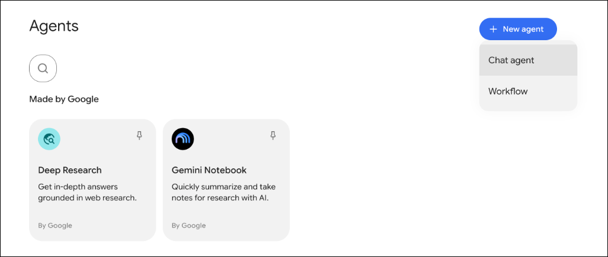

<br><br>

3. At the bottom of the Agent Designer page, you'll see a prompt input. Enter: 
   `Use google search capabilities to prepare a daily briefing of news from the past 48 hours on the topics provided. The brief should be presented in a bulleted list with key phrases bolded.`

   <br>

   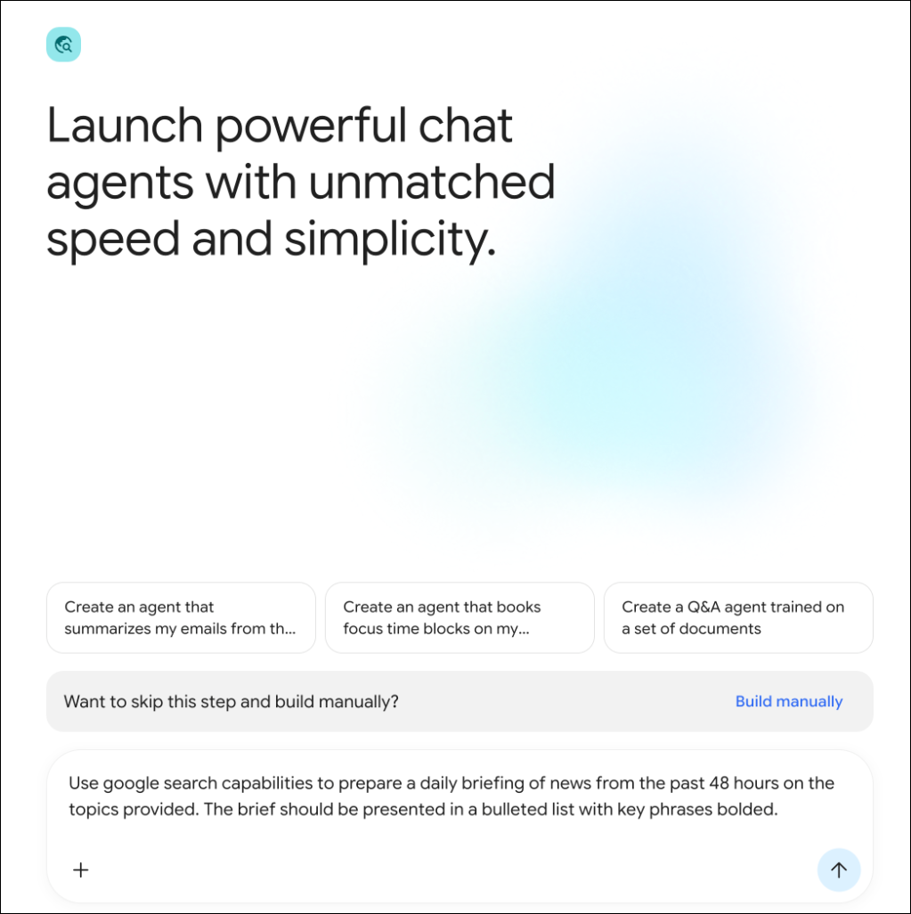

<br><br>

4. **Submit the Prompt:**
   * Click submit.
   * *You will see a preview panel featuring a draft of your agent.*


5. **Explore Agent View:**
   * At the top of the agent's preview card, explore **Flow**, **Schedule**, and **Preview**.
   * Click **Flow** to see the auto-created Builder view.
   
   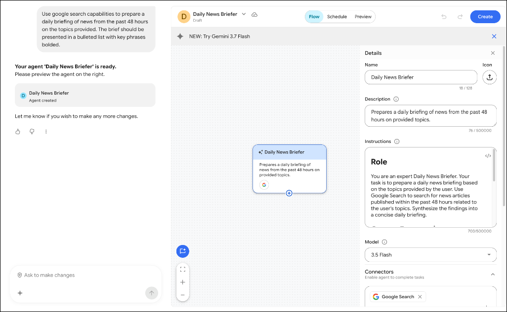

<br><br>

6. Click **Schedule** at the top of the agent draft panel to automate your daily briefing.

7. Click **+ Add schedule**. 

   

<br><br>

8. Keep the frequency set to **Daily** with the default time and timezone. For the **triggering prompt**, enter:

       Prepare my daily briefing on the following topics:
       - Lawn watering automation
       - Solar panel technology
       - Landscape lighting
       - Sales on large planters
   
   

<br><br>

9. Click **Add schedule** at the bottom to confirm.

10. Click the **play icon (Run in Preview)** to run the agent with the scheduled prompt immediately. 


<br><br>

You'll see a result in the agent draft's Preview tab.

11. To save your agent for future use, click **Create** in the upper right. *(Note: This scheduled agent will now run daily based on the schedule you set.)*

12. **Test the Agent:**
    * Select **Agents** on the left navigation panel.
    * **Click** on the newly created agent.
   
   Make sure the **Google Search** connector is enabled under Tools and type `I need a quick news summary on global economic trends and cybersecurity threats over the last 48 hours.`

   <br>

   

<br><br>

<div class="nav-link"><a href="#top">↑ Back to Top</a></div>

---

<div id='section-12'></div>
 
# Task 12: Build a Chat Agent with the Agent Designer Builder (Manually)
 
Take more control of the agent-building process by using the manual Builder interface and adding multi-step subagents.
 
1. In the left-hand navigation menu, click **Agents**, click **+ New agent**, and then click on **Chat agent**.
 
2. To bypass the prompt input and build manually, click the **Build manually** link (in blue).

   <br>

   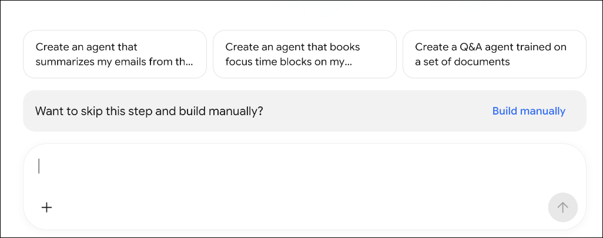

<br><br>
   
3. Click the starting agent node named **My Agent**.
 
4. Update the agent's **Name** to `Sales Call Followup Agent`.
 
5. Next to the agent's Name field, click on the upload icon labeled **Icon**. [Download a Sample Robot Icon here](https://github.com/caugusto/GE-Value-workshop/raw/main/data/ge_sample_data_for_workshop/robot_icon.jpg).
   
   
 
<br><br>
 
6. For the **Description**, enter:
   `Agent to help with next steps after sales calls.`
 
7. For **Instructions**, enter:
   `When presented with notes from a sales call, write a 1-sentence paragraph thanking the customer for the opportunity to bid on their project and write a paragraph to summarize of the call. Then transfer to the Followup Questions subagent.`
 
8. **Add a Subagent:**
   * Click the grid to dismiss the detail popup.
   * Hover over the agent node.
   * Click the **plus icon** to add a subagent.
   
   <br>

   

   <br>

   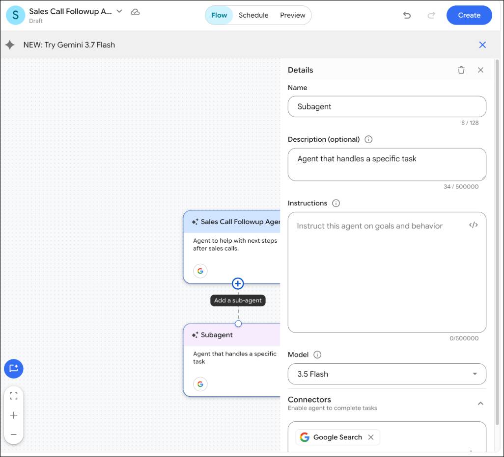

<br><br>
 
9. Update the subagent's **Name** to `Followup Questions`.
 
10. For the **Description**, enter:
    `Generate additional discovery questions based on the customer's scope.`
 
11. For **Instructions**, enter:
    `Develop a list of discovery questions to define the client's needs requirements for materials, tools, and additional expenses (walkway stones, fountains, landscape lighting, etc. in greater detail).`
 
12. In the upper right corner, click **Create**.
 
13. Click **Chat with Agent**. In the input field, test your new agent by entering the following sales call notes:
 
        The Wilson Hotel Sales Call Notes:
        - customer needs lawn maintenance
        - 3 hectares of land
        - needs a pond dug and 3 trees planted
        - wants lawn maintained twice per month
    
    
 
<br><br>
 
14. In the left-hand navigation, click the **Agents** section header. You will now see your *Sales Call Followup Agent* listed under *Your agents*.
 
15. **Pin the Agent:**
    * Click the **three dots** on the agent's card.
    * Select the **pin icon** for quick access from the navigation pane.
    * Notice the agent now appears on the left side navigation, under the **Agents** section.
    
    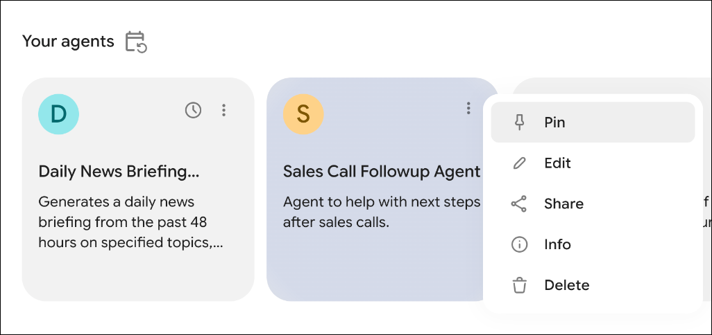
 
<br><br>
 
</div>
---
 
<div id='section-13'></div>
  
# Task 13: Build a Workflow Agent
 
Workflow Agents automate scheduled or event-driven tasks across your enterprise tools. While Chat Agents focus on interactive conversations, Workflow Agents run background processes (such as automated market briefings or status reports), orchestrate triggers and actions, and deliver structured results directly on a recurring schedule.
 
1. **Initiate Workflow Creation:**
   * In the left-hand navigation menu, click **Agents**.
   * Click **+ New agent** and select **Workflow**.
 
   <br>
 
   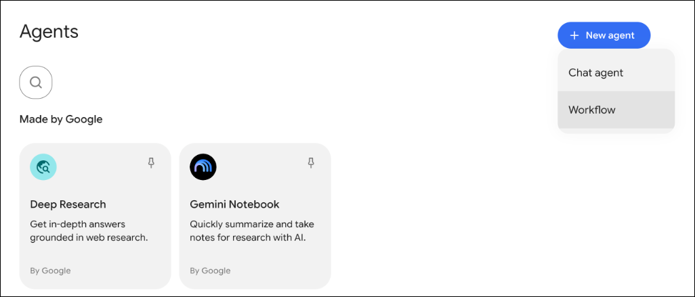
 
<br><br>
 
2. **Describe What Your Workflow Should Do:**
   * In the **Let's build your workflow** prompt box:
   * **Type**: `Create a personalized stock market report every morning of the week using Google Search. Start your day with a personalized market briefing . Every weekday morning, this workflow scans for top gainers, losers, and key market news, then builds a concise summary to keep you informed. You can easily customize it to track specific stocks, focus on an industry, or adjust the information highlighted in your report.`
   * **Submit** the query.
 
   <br>
 
   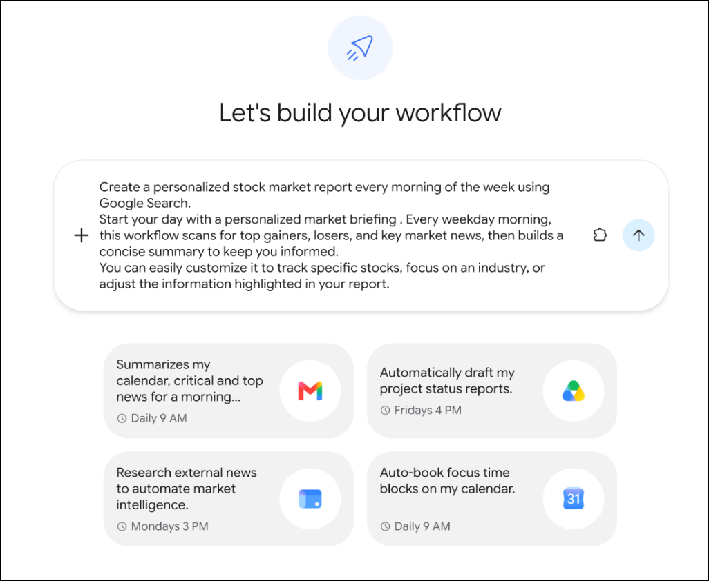
 
<br><br>
 
3. **Review and Confirm the Workflow Plan:**
   * Gemini Enterprise analyzes your requirements and proposes a structured workflow plan including automated triggers (e.g., weekday morning at 9:00 AM) and research actions using Google Search.
   * Review the proposed plan to confirm it looks good or adjust it as needed.
   * In the prompt bar:
   * **Type**: `Looks good to me` (or click the **+ Looks good to me** suggestion chip).
   * **Submit** the query.
 
   <br>
 
   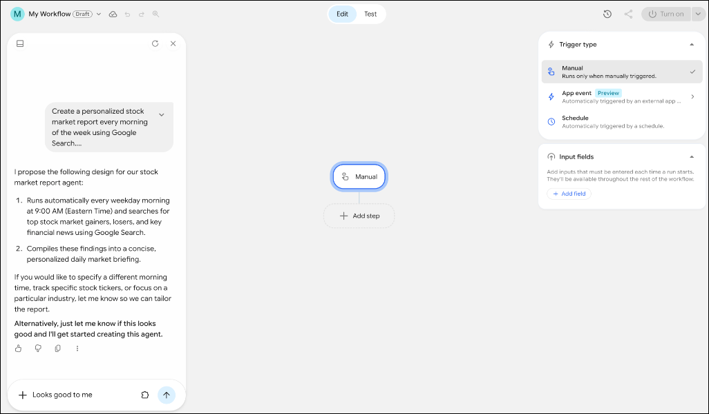
 
<br><br>
 
4. **Test the Workflow Execution:**
   * Switch to the **Test** tab at the top of the workflow editor.
   * Click on **Start a test run** to trigger a manual run and validate the workflow execution.
 
   <br>
 
   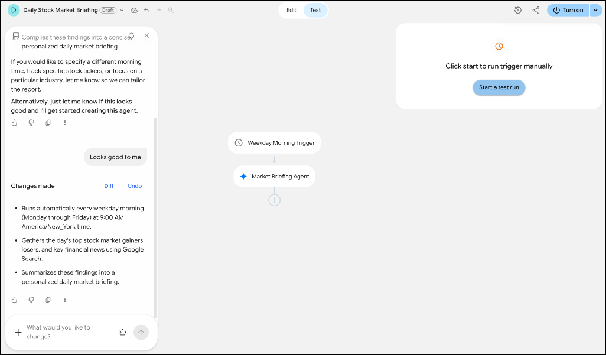
 
<br><br>
 
5. **Review Test Results and Activate:**
   * Verify that the test execution succeeded with all steps completed (marked with green checkmarks).
   * Review the compiled market briefing summary delivered in the output panel.
   * Click on **Turn on** (in the top right corner) to activate the workflow on its automated schedule.
 
   <br>
 
   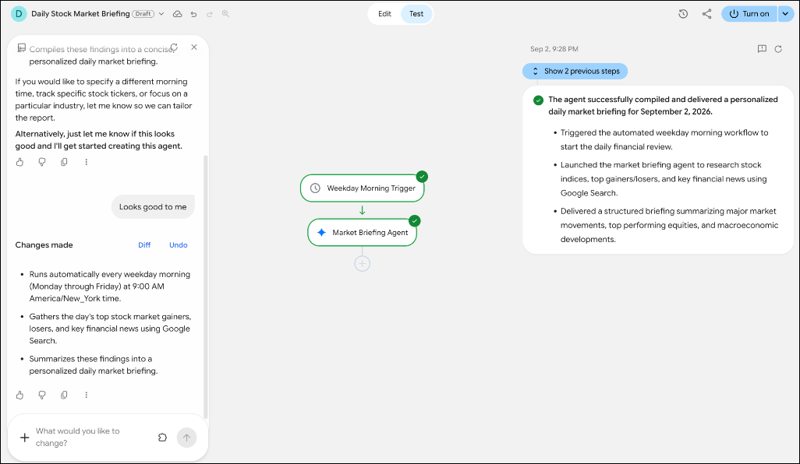
 
<br><br>
 
6. **Authorize Account Access (If Prompted):**
   * If prompted with **Allow Gemini Enterprise to access your Google Account**, review the permissions requested to run scheduled activities on your behalf.
   * Click **Authorize** to grant access and complete activating your automated workflow. *(Note: If your account was already authorized previously, this prompt may not be required).*

   <br>

   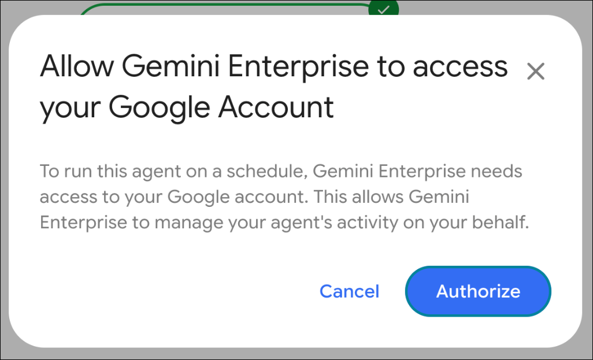

<br><br>

7. **Challenge Step — Add a Step to Send an Email to Yourself:**
   * In the left-hand navigation menu, click **Agents** and locate your market briefing agent under *Your agents*.
   * Click the **three dots** on the agent card and select **Edit**.

   <br>

   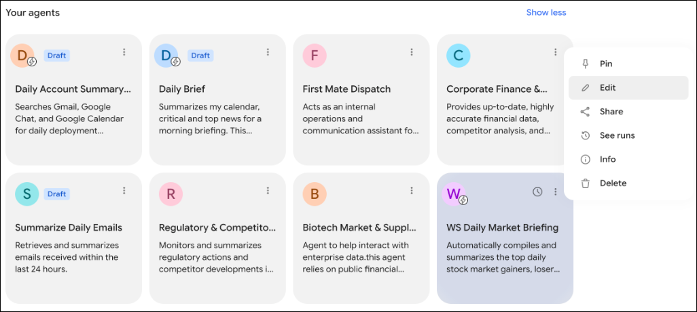

   <br>

   * In the **Connected apps** side panel on the right, ensure **Mail** is enabled (click **Enable actions** / authorize your email account if prompted).

   <br>

   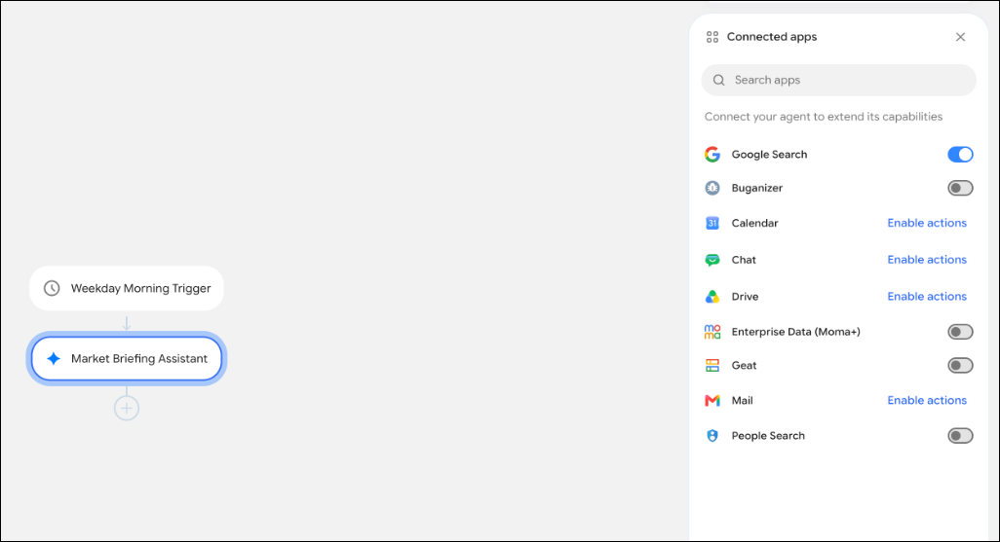

   <br>

   * In the chatbot panel on the left:
   * **Type**: `Change the agent and add a step at the end to email the final report to (your_email)` *(replace `(your_email)` with your actual email address)*.
   * **Submit** the prompt.

   <br>

   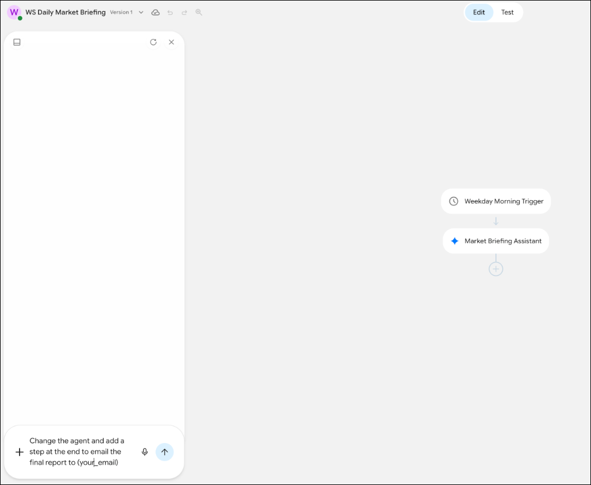

   <br>

   * *Notice that the new **Email Briefing** step has been automatically added to the workflow canvas with its instructions populated in the right panel.*

   <br>

   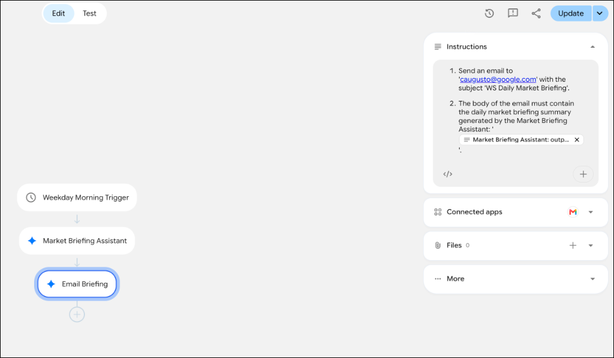

   <br>

   * Switch to the **Test** tab, click **Start a test run**, and check your inbox to verify that you receive the market briefing email.
   * Click **Update** in the top-right corner to save and apply the updated workflow.

   <br>

   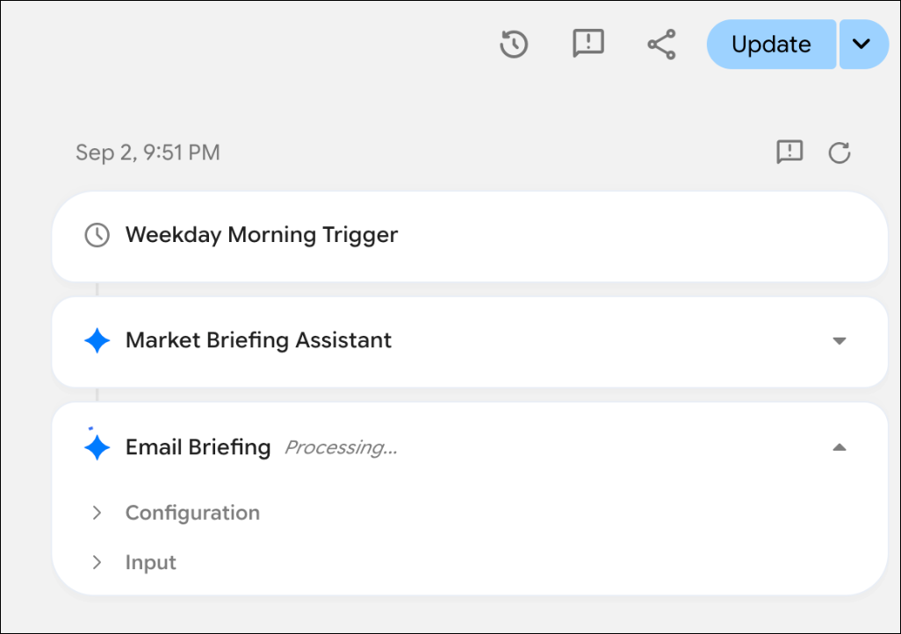

<br><br>
 
<div class="nav-link"><a href="#top">↑ Back to Top</a></div>
 
---
 
<div id='section-14'></div>
 
# Task 14: Gemini Notebook Challenge Labs

Welcome to the Gemini Notebook Challenge Labs! These exercises are designed to test your ability to synthesize information, extract insights, and generate multi-modal outputs using Gemini Notebook. 

**Instructions:** Please select **one** of the three challenges below to complete. You will be given a scenario and a set of objectives. It is up to you to determine the best prompts and tools within Gemini Notebook to accomplish the goals.

## Challenge Lab 1: Financial Analyst Briefing (Market Research)

**Scenario:** 
You are a financial analyst at a top investment firm. Earnings season is in full swing, and you need to quickly digest Alphabet's (Google's) Q4 2025 earnings call and their official press release to prepare a briefing for your portfolio manager. Your portfolio manager wants a high-level overview, a breakdown of risks, and an audio summary they can listen to on their commute.

**Data Sources Needed:**
1. **YouTube Video:** Alphabet Q4 2025 Earnings Call (Use this link: `https://www.youtube.com/watch?v=mIK5-yi7a-c`)
2. **Document:** Alphabet Q4 2025 Earnings Press Release (Use this link: `https://s206.q4cdn.com/479360582/files/doc_financials/2025/q4/2025q4-alphabet-earnings-release.pdf`)
3. **Website:** Google's History (Use this link: `https://about.google/company-info/our-story/`)
4. **Discover Sources:** Use the Gemini Notebook "Discover sources" feature to find and insert an article on "Recent trends in Artificial Intelligence capital expenditures".

**Your Challenge Objectives:**
1. **Workspace Setup:** Create a new notebook and ingest the YouTube video link, the PDF press release, the "Our Story" web link, and your newly discovered article on AI capex trends.
2. **Company Timeline:** Using the "Our Story" link, create a chronological timeline of major milestones in Google's history. Save this to a note.
3. **Revenue Drivers:** Extract a summary of the top 3 revenue-driving products or services mentioned across both earnings sources. Save this insight as a saved note.
4. **Risk Identification:** Identify the biggest risks, headwinds, or challenges the executives discussed on the call. Pin this response.
5. **Q&A Extraction:** Extract and list all questions asked by analysts during the earnings call, along with a summary of the executives' answers. Save this to a note.
6. **Commuter Briefing (Audio):** Generate an "Audio Overview" podcast discussing the company's AI investments and capital expenditures specifically, ignoring other segments.

---

## Challenge Lab 2: GTM Strategy & Cross-Department Synthesis (Marketing)

**Scenario:** 
You are a Go-To-Market (GTM) Strategy Analyst at XYZ Sales Company. Your Director has provided you with raw text files containing marketing campaign data, sales performance metrics, and direct customer feedback from the last quarter. Your task is to use Gemini Notebook to find correlations between marketing efforts, sales results, and customer sentiment to recommend actions for the next quarter.

**Data Sources Needed:**
*(These files are located in your `data/ge_sample_data_for_workshop/xyz-sales-company/notebooklm` directory)*
1. `MARKETING_data.txt`
2. `SALES_data.txt`
3. `customer_feedback.txt`
4. **Discover Sources:** Use the Gemini Notebook "Discover sources" feature to find a guide on "Best practices for interpreting customer feedback and B2B sales data".

**Your Challenge Objectives:**
1. **Workspace Setup:** Create a new notebook named "XYZ GTM Strategy", upload all three text files, and add the discovered best practices guide.
2. **Cross-Department Synthesis:** Identify three specific areas where marketing campaigns directly influenced (or failed to influence) sales results according to the data. 
3. **Sentiment Analysis:** Analyze the customer feedback document and summarize the top three most recurring themes. Determine if these themes align with any specific sales or marketing initiatives mentioned in the other documents.
4. **Strategy Memo Generation:** Generate a concise "Next Quarter Strategy Memo" for the GTM Director. Based strictly on the combined data and feedback, recommend two specific, actionable steps the company should take. Save this as a final note for the Director.
5. **Team Briefing (Video):** Generate a Video Overview to share with the broader GTM team that highlights the alignment (or misalignment) between your marketing efforts and customer happiness.

---

## Challenge Lab 3: Caffeine & Sleep Analysis (Medical Research)

**Scenario:** 
You are a health and wellness writer preparing an evidence-based article. You need to correlate clinical research on caffeine and sleep architecture with general knowledge about sleep hygiene to make a compelling, scientifically-backed case for your readers. Instead of using provided files, you will rely entirely on Gemini Notebook's ability to discover reputable sources for you.

**Data Sources Needed:**
1. **Medical Article (URL):** The Sleep Foundation's comprehensive guide on caffeine and sleep (Use this link: `https://www.sleepfoundation.org/nutrition/caffeine-and-sleep`).
2. **Discover Sources (Medical Study):** Use the Gemini Notebook "Discover sources" feature to search for and insert a clinical or academic overview on "The physiological effects of caffeine on adenosine receptors and sleep cycles".
3. **Discover Sources (Best Practices):** Use the Gemini Notebook "Discover sources" feature to search for and insert an article on "Evidence-based sleep hygiene tips for adults".

**Your Challenge Objectives:**
1. **Workspace Setup:** Create a new notebook named "Sleep Analysis" and use the Discover sources feature to populate it with at least two high-quality articles based on the topics above.
2. **Data Correlation:** Ask Gemini Notebook to synthesize the sources and explain exactly *why* late-day caffeine intake leads to lower sleep scores, citing the biological mechanisms (e.g., adenosine receptors). Pin the response.
3. **Wellness Plan:** Generate a personalized 3-point action plan for a hypothetical client who drinks coffee at 5 PM, based on the discovered medical recommendations. 
4. **Study Summary Brief:** Generate a Briefing Doc highlighting the key takeaways from the clinical study you discovered.
5. **Client Audio Overview:** Generate an "Audio Overview" podcast discussing the client's new wellness plan and how adenosine receptors work, so the client can listen to it on their commute.

<br>

<div class="nav-link"><a href="#top">↑ Back to Top</a></div>

---

# 🎉 Congratulations!

You have completed the **Gemini Enterprise Hands-on Lab**.

**What you accomplished today:**
- **Familiarized** yourself with the basic Assistant features.
- **Mastered the ABCDQs of Prompting** to construct structured, high-impact seed prompts.
- **Configured** Personalization and Appearance to match your work style.
- **Leveraged** Search and File Analysis to interact with web and internal data.
- **Generated Media** (Images and Veo Videos) directly within chat.
- **Collaborated with Canvas** to create presentations and interactive documents.
- **Used and Created Skills** to automate structured tasks and brand guidelines.
- **Conducted Deep Research** to produce synthesized reports with citations.
- **Explored Gemini Notebook** to anchor AI insights strictly to your trusted documents and generate multi-modal summaries.
- **Discovered and Created custom agents** to solve common workflow problems in just a few steps.

You are now ready to apply these items to increase your daily productivity.
